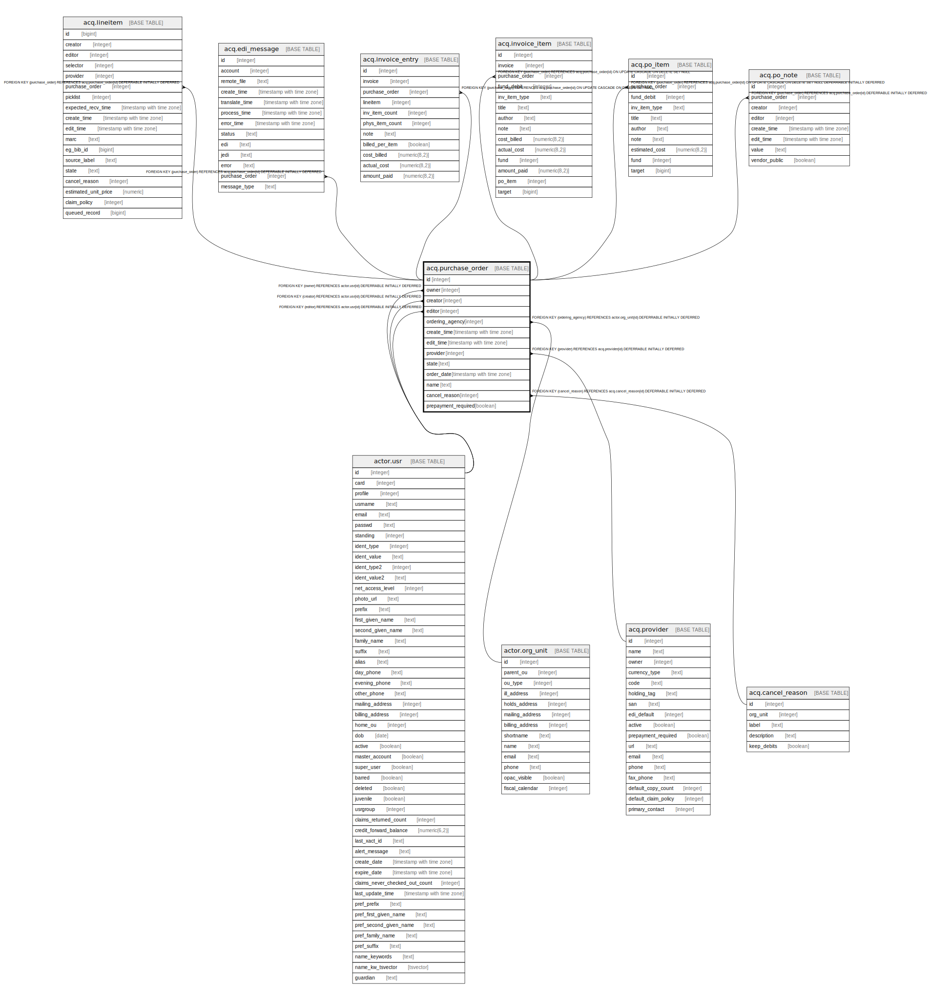

# acq.purchase_order

## Description

## Columns

| Name | Type | Default | Nullable | Children | Parents | Comment |
| ---- | ---- | ------- | -------- | -------- | ------- | ------- |
| id | integer | nextval('acq.purchase_order_id_seq'::regclass) | false | [acq.lineitem](acq.lineitem.md) [acq.edi_message](acq.edi_message.md) [acq.invoice_entry](acq.invoice_entry.md) [acq.invoice_item](acq.invoice_item.md) [acq.po_item](acq.po_item.md) [acq.po_note](acq.po_note.md) |  |  |
| owner | integer |  | false |  | [actor.usr](actor.usr.md) |  |
| creator | integer |  | false |  | [actor.usr](actor.usr.md) |  |
| editor | integer |  | false |  | [actor.usr](actor.usr.md) |  |
| ordering_agency | integer |  | false |  | [actor.org_unit](actor.org_unit.md) |  |
| create_time | timestamp with time zone | now() | false |  |  |  |
| edit_time | timestamp with time zone | now() | false |  |  |  |
| provider | integer |  | false |  | [acq.provider](acq.provider.md) |  |
| state | text | 'new'::text | false |  |  |  |
| order_date | timestamp with time zone |  | true |  |  |  |
| name | text |  | false |  |  |  |
| cancel_reason | integer |  | true |  | [acq.cancel_reason](acq.cancel_reason.md) |  |
| prepayment_required | boolean | false | false |  |  |  |

## Constraints

| Name | Type | Definition |
| ---- | ---- | ---------- |
| valid_po_state | CHECK | CHECK ((state = ANY (ARRAY['new'::text, 'pending'::text, 'on-order'::text, 'received'::text, 'cancelled'::text]))) |
| purchase_order_cancel_reason_fkey | FOREIGN KEY | FOREIGN KEY (cancel_reason) REFERENCES acq.cancel_reason(id) DEFERRABLE INITIALLY DEFERRED |
| purchase_order_provider_fkey | FOREIGN KEY | FOREIGN KEY (provider) REFERENCES acq.provider(id) DEFERRABLE INITIALLY DEFERRED |
| purchase_order_pkey | PRIMARY KEY | PRIMARY KEY (id) |
| purchase_order_ordering_agency_fkey | FOREIGN KEY | FOREIGN KEY (ordering_agency) REFERENCES actor.org_unit(id) DEFERRABLE INITIALLY DEFERRED |
| purchase_order_creator_fkey | FOREIGN KEY | FOREIGN KEY (creator) REFERENCES actor.usr(id) DEFERRABLE INITIALLY DEFERRED |
| purchase_order_editor_fkey | FOREIGN KEY | FOREIGN KEY (editor) REFERENCES actor.usr(id) DEFERRABLE INITIALLY DEFERRED |
| purchase_order_owner_fkey | FOREIGN KEY | FOREIGN KEY (owner) REFERENCES actor.usr(id) DEFERRABLE INITIALLY DEFERRED |

## Indexes

| Name | Definition |
| ---- | ---------- |
| purchase_order_pkey | CREATE UNIQUE INDEX purchase_order_pkey ON acq.purchase_order USING btree (id) |
| acq_po_org_name_order_date_idx | CREATE INDEX acq_po_org_name_order_date_idx ON acq.purchase_order USING btree (ordering_agency, name, order_date) |
| po_creator_idx | CREATE INDEX po_creator_idx ON acq.purchase_order USING btree (creator) |
| po_editor_idx | CREATE INDEX po_editor_idx ON acq.purchase_order USING btree (editor) |
| po_owner_idx | CREATE INDEX po_owner_idx ON acq.purchase_order USING btree (owner) |
| po_provider_idx | CREATE INDEX po_provider_idx ON acq.purchase_order USING btree (provider) |
| po_state_idx | CREATE INDEX po_state_idx ON acq.purchase_order USING btree (state) |

## Triggers

| Name | Definition |
| ---- | ---------- |
| audit_acq_purchase_order_update_trigger | CREATE TRIGGER audit_acq_purchase_order_update_trigger AFTER DELETE OR UPDATE ON acq.purchase_order FOR EACH ROW EXECUTE PROCEDURE acq.audit_acq_purchase_order_func() |
| po_name_default_trg | CREATE TRIGGER po_name_default_trg BEFORE INSERT OR UPDATE ON acq.purchase_order FOR EACH ROW EXECUTE PROCEDURE acq.purchase_order_name_default() |
| po_org_name_date_unique_trg | CREATE TRIGGER po_org_name_date_unique_trg BEFORE INSERT OR UPDATE ON acq.purchase_order FOR EACH ROW EXECUTE PROCEDURE acq.po_org_name_date_unique() |

## Relations

---

> Generated by [tbls](https://github.com/k1LoW/tbls)
