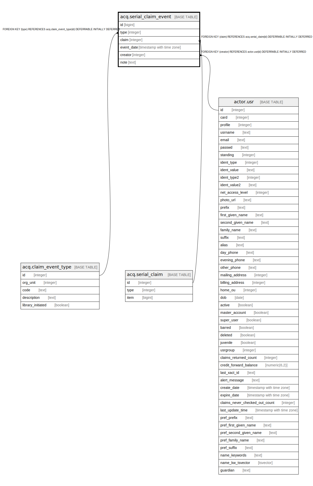

# acq.serial_claim_event

## Description

## Columns

| Name | Type | Default | Nullable | Children | Parents | Comment |
| ---- | ---- | ------- | -------- | -------- | ------- | ------- |
| id | bigint | nextval('acq.serial_claim_event_id_seq'::regclass) | false |  |  |  |
| type | integer |  | false |  | [acq.claim_event_type](acq.claim_event_type.md) |  |
| claim | integer | nextval('acq.serial_claim_event_claim_seq'::regclass) | false |  | [acq.serial_claim](acq.serial_claim.md) |  |
| event_date | timestamp with time zone | now() | false |  |  |  |
| creator | integer |  | false |  | [actor.usr](actor.usr.md) |  |
| note | text |  | true |  |  |  |

## Constraints

| Name | Type | Definition |
| ---- | ---- | ---------- |
| serial_claim_event_type_fkey | FOREIGN KEY | FOREIGN KEY (type) REFERENCES acq.claim_event_type(id) DEFERRABLE INITIALLY DEFERRED |
| serial_claim_event_pkey | PRIMARY KEY | PRIMARY KEY (id) |
| serial_claim_event_claim_fkey | FOREIGN KEY | FOREIGN KEY (claim) REFERENCES acq.serial_claim(id) DEFERRABLE INITIALLY DEFERRED |
| serial_claim_event_creator_fkey | FOREIGN KEY | FOREIGN KEY (creator) REFERENCES actor.usr(id) DEFERRABLE INITIALLY DEFERRED |

## Indexes

| Name | Definition |
| ---- | ---------- |
| serial_claim_event_pkey | CREATE UNIQUE INDEX serial_claim_event_pkey ON acq.serial_claim_event USING btree (id) |
| serial_claim_event_claim_date_idx | CREATE INDEX serial_claim_event_claim_date_idx ON acq.serial_claim_event USING btree (claim, event_date) |

## Relations

---

> Generated by [tbls](https://github.com/k1LoW/tbls)
