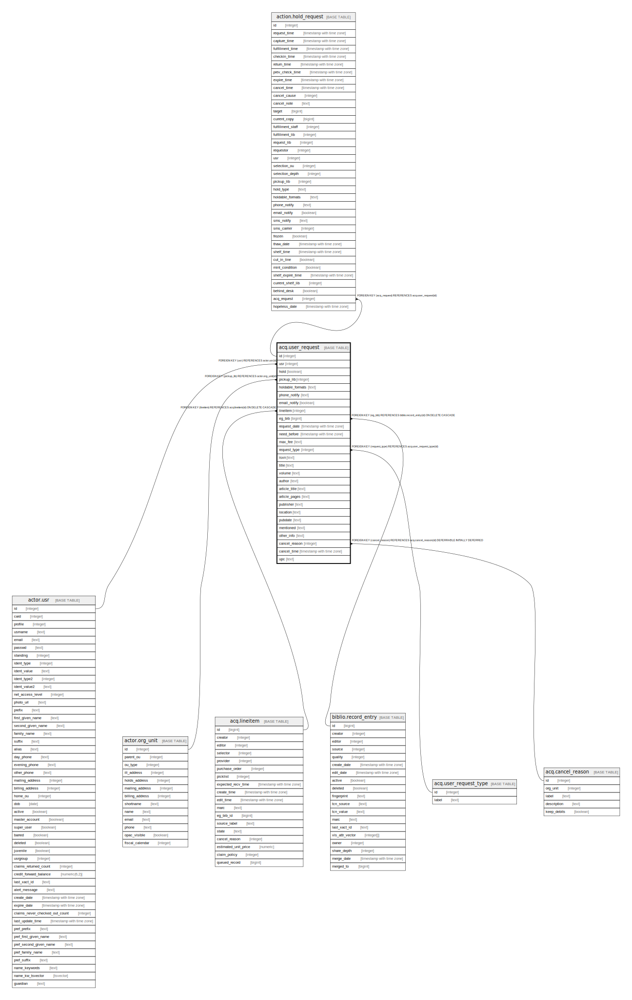

# acq.user_request

## Description

## Columns

| Name | Type | Default | Nullable | Children | Parents | Comment |
| ---- | ---- | ------- | -------- | -------- | ------- | ------- |
| id | integer | nextval('acq.user_request_id_seq'::regclass) | false | [action.hold_request](action.hold_request.md) |  |  |
| usr | integer |  | false |  | [actor.usr](actor.usr.md) |  |
| hold | boolean | true | false |  |  |  |
| pickup_lib | integer |  | false |  | [actor.org_unit](actor.org_unit.md) |  |
| holdable_formats | text |  | true |  |  |  |
| phone_notify | text |  | true |  |  |  |
| email_notify | boolean | true | false |  |  |  |
| lineitem | integer |  | true |  | [acq.lineitem](acq.lineitem.md) |  |
| eg_bib | bigint |  | true |  | [biblio.record_entry](biblio.record_entry.md) |  |
| request_date | timestamp with time zone | now() | false |  |  |  |
| need_before | timestamp with time zone |  | true |  |  |  |
| max_fee | text |  | true |  |  |  |
| request_type | integer |  | false |  | [acq.user_request_type](acq.user_request_type.md) |  |
| isxn | text |  | true |  |  |  |
| title | text |  | true |  |  |  |
| volume | text |  | true |  |  |  |
| author | text |  | true |  |  |  |
| article_title | text |  | true |  |  |  |
| article_pages | text |  | true |  |  |  |
| publisher | text |  | true |  |  |  |
| location | text |  | true |  |  |  |
| pubdate | text |  | true |  |  |  |
| mentioned | text |  | true |  |  |  |
| other_info | text |  | true |  |  |  |
| cancel_reason | integer |  | true |  | [acq.cancel_reason](acq.cancel_reason.md) |  |
| cancel_time | timestamp with time zone |  | true |  |  |  |
| upc | text |  | true |  |  |  |

## Constraints

| Name | Type | Definition |
| ---- | ---- | ---------- |
| user_request_cancel_reason_fkey | FOREIGN KEY | FOREIGN KEY (cancel_reason) REFERENCES acq.cancel_reason(id) DEFERRABLE INITIALLY DEFERRED |
| user_request_lineitem_fkey | FOREIGN KEY | FOREIGN KEY (lineitem) REFERENCES acq.lineitem(id) ON DELETE CASCADE |
| user_request_pkey | PRIMARY KEY | PRIMARY KEY (id) |
| user_request_request_type_fkey | FOREIGN KEY | FOREIGN KEY (request_type) REFERENCES acq.user_request_type(id) |
| user_request_pickup_lib_fkey | FOREIGN KEY | FOREIGN KEY (pickup_lib) REFERENCES actor.org_unit(id) |
| user_request_usr_fkey | FOREIGN KEY | FOREIGN KEY (usr) REFERENCES actor.usr(id) |
| user_request_eg_bib_fkey | FOREIGN KEY | FOREIGN KEY (eg_bib) REFERENCES biblio.record_entry(id) ON DELETE CASCADE |

## Indexes

| Name | Definition |
| ---- | ---------- |
| user_request_pkey | CREATE UNIQUE INDEX user_request_pkey ON acq.user_request USING btree (id) |

## Relations

---

> Generated by [tbls](https://github.com/k1LoW/tbls)
