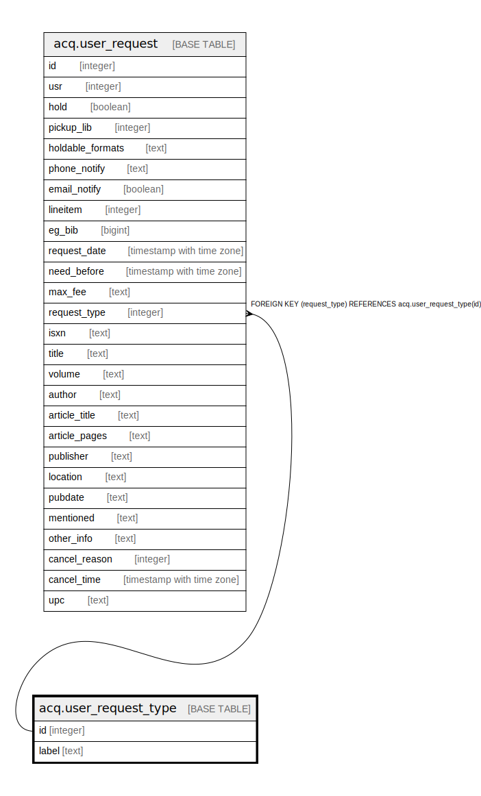

# acq.user_request_type

## Description

## Columns

| Name | Type | Default | Nullable | Children | Parents | Comment |
| ---- | ---- | ------- | -------- | -------- | ------- | ------- |
| id | integer | nextval('acq.user_request_type_id_seq'::regclass) | false | [acq.user_request](acq.user_request.md) |  |  |
| label | text |  | false |  |  |  |

## Constraints

| Name | Type | Definition |
| ---- | ---- | ---------- |
| user_request_type_label_key | UNIQUE | UNIQUE (label) |
| user_request_type_pkey | PRIMARY KEY | PRIMARY KEY (id) |

## Indexes

| Name | Definition |
| ---- | ---------- |
| user_request_type_label_key | CREATE UNIQUE INDEX user_request_type_label_key ON acq.user_request_type USING btree (label) |
| user_request_type_pkey | CREATE UNIQUE INDEX user_request_type_pkey ON acq.user_request_type USING btree (id) |

## Relations

---

> Generated by [tbls](https://github.com/k1LoW/tbls)
