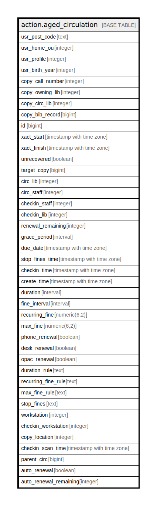

# action.aged_circulation

## Description

## Columns

| Name | Type | Default | Nullable | Children | Parents | Comment |
| ---- | ---- | ------- | -------- | -------- | ------- | ------- |
| usr_post_code | text |  | true |  |  |  |
| usr_home_ou | integer |  | false |  |  |  |
| usr_profile | integer |  | false |  |  |  |
| usr_birth_year | integer |  | true |  |  |  |
| copy_call_number | integer |  | false |  |  |  |
| copy_owning_lib | integer |  | false |  |  |  |
| copy_circ_lib | integer |  | false |  |  |  |
| copy_bib_record | bigint |  | false |  |  |  |
| id | bigint |  | false |  |  |  |
| xact_start | timestamp with time zone |  | false |  |  |  |
| xact_finish | timestamp with time zone |  | true |  |  |  |
| unrecovered | boolean |  | true |  |  |  |
| target_copy | bigint |  | false |  |  |  |
| circ_lib | integer |  | false |  |  |  |
| circ_staff | integer |  | false |  |  |  |
| checkin_staff | integer |  | true |  |  |  |
| checkin_lib | integer |  | true |  |  |  |
| renewal_remaining | integer |  | false |  |  |  |
| grace_period | interval |  | false |  |  |  |
| due_date | timestamp with time zone |  | true |  |  |  |
| stop_fines_time | timestamp with time zone |  | true |  |  |  |
| checkin_time | timestamp with time zone |  | true |  |  |  |
| create_time | timestamp with time zone |  | false |  |  |  |
| duration | interval |  | true |  |  |  |
| fine_interval | interval |  | false |  |  |  |
| recurring_fine | numeric(6,2) |  | true |  |  |  |
| max_fine | numeric(6,2) |  | true |  |  |  |
| phone_renewal | boolean |  | false |  |  |  |
| desk_renewal | boolean |  | false |  |  |  |
| opac_renewal | boolean |  | false |  |  |  |
| duration_rule | text |  | false |  |  |  |
| recurring_fine_rule | text |  | false |  |  |  |
| max_fine_rule | text |  | false |  |  |  |
| stop_fines | text |  | true |  |  |  |
| workstation | integer |  | true |  |  |  |
| checkin_workstation | integer |  | true |  |  |  |
| copy_location | integer |  | false |  |  |  |
| checkin_scan_time | timestamp with time zone |  | true |  |  |  |
| parent_circ | bigint |  | true |  |  |  |
| auto_renewal | boolean | false | false |  |  |  |
| auto_renewal_remaining | integer |  | true |  |  |  |

## Constraints

| Name | Type | Definition |
| ---- | ---- | ---------- |
| aged_circulation_pkey | PRIMARY KEY | PRIMARY KEY (id) |

## Indexes

| Name | Definition |
| ---- | ---------- |
| aged_circulation_pkey | CREATE UNIQUE INDEX aged_circulation_pkey ON action.aged_circulation USING btree (id) |
| action_aged_circulation_parent_circ_idx | CREATE INDEX action_aged_circulation_parent_circ_idx ON action.aged_circulation USING btree (parent_circ) |
| action_aged_circulation_target_copy_idx | CREATE INDEX action_aged_circulation_target_copy_idx ON action.aged_circulation USING btree (target_copy) |
| aged_circ_circ_lib_idx | CREATE INDEX aged_circ_circ_lib_idx ON action.aged_circulation USING btree (circ_lib) |
| aged_circ_copy_circ_lib_idx | CREATE INDEX aged_circ_copy_circ_lib_idx ON action.aged_circulation USING btree (copy_circ_lib) |
| aged_circ_copy_location_idx | CREATE INDEX aged_circ_copy_location_idx ON action.aged_circulation USING btree (copy_location) |
| aged_circ_copy_owning_lib_idx | CREATE INDEX aged_circ_copy_owning_lib_idx ON action.aged_circulation USING btree (copy_owning_lib) |
| aged_circ_start_idx | CREATE INDEX aged_circ_start_idx ON action.aged_circulation USING btree (xact_start) |

## Relations

---

> Generated by [tbls](https://github.com/k1LoW/tbls)
