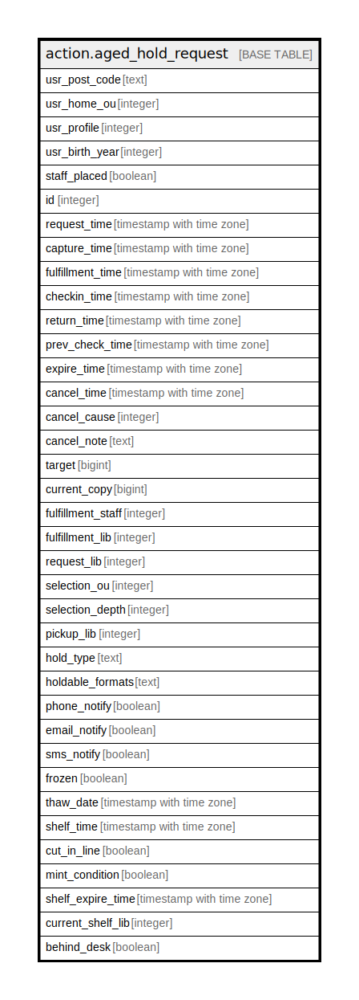

# action.aged_hold_request

## Description

## Columns

| Name | Type | Default | Nullable | Children | Parents | Comment |
| ---- | ---- | ------- | -------- | -------- | ------- | ------- |
| usr_post_code | text |  | true |  |  |  |
| usr_home_ou | integer |  | false |  |  |  |
| usr_profile | integer |  | false |  |  |  |
| usr_birth_year | integer |  | true |  |  |  |
| staff_placed | boolean |  | false |  |  |  |
| id | integer |  | false |  |  |  |
| request_time | timestamp with time zone |  | false |  |  |  |
| capture_time | timestamp with time zone |  | true |  |  |  |
| fulfillment_time | timestamp with time zone |  | true |  |  |  |
| checkin_time | timestamp with time zone |  | true |  |  |  |
| return_time | timestamp with time zone |  | true |  |  |  |
| prev_check_time | timestamp with time zone |  | true |  |  |  |
| expire_time | timestamp with time zone |  | true |  |  |  |
| cancel_time | timestamp with time zone |  | true |  |  |  |
| cancel_cause | integer |  | true |  |  |  |
| cancel_note | text |  | true |  |  |  |
| target | bigint |  | false |  |  |  |
| current_copy | bigint |  | true |  |  |  |
| fulfillment_staff | integer |  | true |  |  |  |
| fulfillment_lib | integer |  | true |  |  |  |
| request_lib | integer |  | false |  |  |  |
| selection_ou | integer |  | false |  |  |  |
| selection_depth | integer |  | false |  |  |  |
| pickup_lib | integer |  | false |  |  |  |
| hold_type | text |  | false |  |  |  |
| holdable_formats | text |  | true |  |  |  |
| phone_notify | boolean |  | false |  |  |  |
| email_notify | boolean |  | false |  |  |  |
| sms_notify | boolean |  | false |  |  |  |
| frozen | boolean |  | false |  |  |  |
| thaw_date | timestamp with time zone |  | true |  |  |  |
| shelf_time | timestamp with time zone |  | true |  |  |  |
| cut_in_line | boolean |  | true |  |  |  |
| mint_condition | boolean |  | false |  |  |  |
| shelf_expire_time | timestamp with time zone |  | true |  |  |  |
| current_shelf_lib | integer |  | true |  |  |  |
| behind_desk | boolean |  | false |  |  |  |

## Constraints

| Name | Type | Definition |
| ---- | ---- | ---------- |
| aged_hold_request_pkey | PRIMARY KEY | PRIMARY KEY (id) |

## Indexes

| Name | Definition |
| ---- | ---------- |
| aged_hold_request_pkey | CREATE UNIQUE INDEX aged_hold_request_pkey ON action.aged_hold_request USING btree (id) |
| aged_hold_request_current_copy_idx | CREATE INDEX aged_hold_request_current_copy_idx ON action.aged_hold_request USING btree (current_copy) |
| aged_hold_request_fulfillment_staff_idx | CREATE INDEX aged_hold_request_fulfillment_staff_idx ON action.aged_hold_request USING btree (fulfillment_staff) |
| aged_hold_request_pickup_lib_idx | CREATE INDEX aged_hold_request_pickup_lib_idx ON action.aged_hold_request USING btree (pickup_lib) |
| aged_hold_request_target_idx | CREATE INDEX aged_hold_request_target_idx ON action.aged_hold_request USING btree (target) |

## Relations

---

> Generated by [tbls](https://github.com/k1LoW/tbls)
