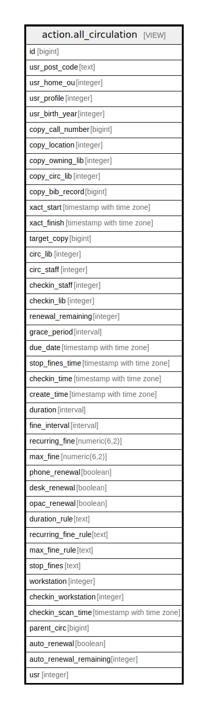

# action.all_circulation

## Description

<details>
<summary><strong>Table Definition</strong></summary>

```sql
CREATE VIEW all_circulation AS (
 SELECT aged_circulation.id,
    aged_circulation.usr_post_code,
    aged_circulation.usr_home_ou,
    aged_circulation.usr_profile,
    aged_circulation.usr_birth_year,
    aged_circulation.copy_call_number,
    aged_circulation.copy_location,
    aged_circulation.copy_owning_lib,
    aged_circulation.copy_circ_lib,
    aged_circulation.copy_bib_record,
    aged_circulation.xact_start,
    aged_circulation.xact_finish,
    aged_circulation.target_copy,
    aged_circulation.circ_lib,
    aged_circulation.circ_staff,
    aged_circulation.checkin_staff,
    aged_circulation.checkin_lib,
    aged_circulation.renewal_remaining,
    aged_circulation.grace_period,
    aged_circulation.due_date,
    aged_circulation.stop_fines_time,
    aged_circulation.checkin_time,
    aged_circulation.create_time,
    aged_circulation.duration,
    aged_circulation.fine_interval,
    aged_circulation.recurring_fine,
    aged_circulation.max_fine,
    aged_circulation.phone_renewal,
    aged_circulation.desk_renewal,
    aged_circulation.opac_renewal,
    aged_circulation.duration_rule,
    aged_circulation.recurring_fine_rule,
    aged_circulation.max_fine_rule,
    aged_circulation.stop_fines,
    aged_circulation.workstation,
    aged_circulation.checkin_workstation,
    aged_circulation.checkin_scan_time,
    aged_circulation.parent_circ,
    aged_circulation.auto_renewal,
    aged_circulation.auto_renewal_remaining,
    NULL::integer AS usr
   FROM action.aged_circulation
UNION ALL
 SELECT DISTINCT circ.id,
    COALESCE(a.post_code, b.post_code) AS usr_post_code,
    p.home_ou AS usr_home_ou,
    p.profile AS usr_profile,
    (date_part('year'::text, p.dob))::integer AS usr_birth_year,
    cp.call_number AS copy_call_number,
    circ.copy_location,
    cn.owning_lib AS copy_owning_lib,
    cp.circ_lib AS copy_circ_lib,
    cn.record AS copy_bib_record,
    circ.xact_start,
    circ.xact_finish,
    circ.target_copy,
    circ.circ_lib,
    circ.circ_staff,
    circ.checkin_staff,
    circ.checkin_lib,
    circ.renewal_remaining,
    circ.grace_period,
    circ.due_date,
    circ.stop_fines_time,
    circ.checkin_time,
    circ.create_time,
    circ.duration,
    circ.fine_interval,
    circ.recurring_fine,
    circ.max_fine,
    circ.phone_renewal,
    circ.desk_renewal,
    circ.opac_renewal,
    circ.duration_rule,
    circ.recurring_fine_rule,
    circ.max_fine_rule,
    circ.stop_fines,
    circ.workstation,
    circ.checkin_workstation,
    circ.checkin_scan_time,
    circ.parent_circ,
    circ.auto_renewal,
    circ.auto_renewal_remaining,
    circ.usr
   FROM (((((action.circulation circ
     JOIN asset.copy cp ON ((circ.target_copy = cp.id)))
     JOIN asset.call_number cn ON ((cp.call_number = cn.id)))
     JOIN actor.usr p ON ((circ.usr = p.id)))
     LEFT JOIN actor.usr_address a ON ((p.mailing_address = a.id)))
     LEFT JOIN actor.usr_address b ON ((p.billing_address = b.id)))
)
```

</details>

## Columns

| Name | Type | Default | Nullable | Children | Parents | Comment |
| ---- | ---- | ------- | -------- | -------- | ------- | ------- |
| id | bigint |  | true |  |  |  |
| usr_post_code | text |  | true |  |  |  |
| usr_home_ou | integer |  | true |  |  |  |
| usr_profile | integer |  | true |  |  |  |
| usr_birth_year | integer |  | true |  |  |  |
| copy_call_number | bigint |  | true |  |  |  |
| copy_location | integer |  | true |  |  |  |
| copy_owning_lib | integer |  | true |  |  |  |
| copy_circ_lib | integer |  | true |  |  |  |
| copy_bib_record | bigint |  | true |  |  |  |
| xact_start | timestamp with time zone |  | true |  |  |  |
| xact_finish | timestamp with time zone |  | true |  |  |  |
| target_copy | bigint |  | true |  |  |  |
| circ_lib | integer |  | true |  |  |  |
| circ_staff | integer |  | true |  |  |  |
| checkin_staff | integer |  | true |  |  |  |
| checkin_lib | integer |  | true |  |  |  |
| renewal_remaining | integer |  | true |  |  |  |
| grace_period | interval |  | true |  |  |  |
| due_date | timestamp with time zone |  | true |  |  |  |
| stop_fines_time | timestamp with time zone |  | true |  |  |  |
| checkin_time | timestamp with time zone |  | true |  |  |  |
| create_time | timestamp with time zone |  | true |  |  |  |
| duration | interval |  | true |  |  |  |
| fine_interval | interval |  | true |  |  |  |
| recurring_fine | numeric(6,2) |  | true |  |  |  |
| max_fine | numeric(6,2) |  | true |  |  |  |
| phone_renewal | boolean |  | true |  |  |  |
| desk_renewal | boolean |  | true |  |  |  |
| opac_renewal | boolean |  | true |  |  |  |
| duration_rule | text |  | true |  |  |  |
| recurring_fine_rule | text |  | true |  |  |  |
| max_fine_rule | text |  | true |  |  |  |
| stop_fines | text |  | true |  |  |  |
| workstation | integer |  | true |  |  |  |
| checkin_workstation | integer |  | true |  |  |  |
| checkin_scan_time | timestamp with time zone |  | true |  |  |  |
| parent_circ | bigint |  | true |  |  |  |
| auto_renewal | boolean |  | true |  |  |  |
| auto_renewal_remaining | integer |  | true |  |  |  |
| usr | integer |  | true |  |  |  |

## Referenced Tables

| Name | Columns | Comment | Type |
| ---- | ------- | ------- | ---- |
| [action.aged_circulation](action.aged_circulation.md) | 41 |  | BASE TABLE |
| [action.circulation](action.circulation.md) | 34 |  | BASE TABLE |
| [asset.copy](asset.copy.md) | 33 |  | BASE TABLE |
| [asset.call_number](asset.call_number.md) | 13 |  | BASE TABLE |
| [actor.usr](actor.usr.md) | 49 | <br>User objects<br><br>This table contains the core User objects that describe both<br>staff members and patrons.  The difference between the two<br>types of users is based on the user's permissions.<br> | BASE TABLE |
| [actor.usr_address](actor.usr_address.md) | 14 |  | BASE TABLE |

## Relations



---

> Generated by [tbls](https://github.com/k1LoW/tbls)
