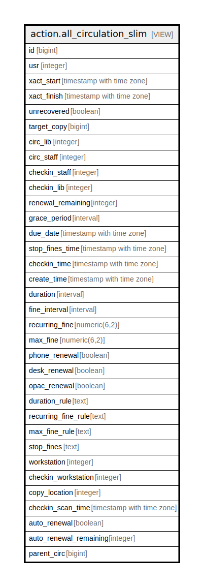

# action.all_circulation_slim

## Description

<details>
<summary><strong>Table Definition</strong></summary>

```sql
CREATE VIEW all_circulation_slim AS (
 SELECT circulation.id,
    circulation.usr,
    circulation.xact_start,
    circulation.xact_finish,
    circulation.unrecovered,
    circulation.target_copy,
    circulation.circ_lib,
    circulation.circ_staff,
    circulation.checkin_staff,
    circulation.checkin_lib,
    circulation.renewal_remaining,
    circulation.grace_period,
    circulation.due_date,
    circulation.stop_fines_time,
    circulation.checkin_time,
    circulation.create_time,
    circulation.duration,
    circulation.fine_interval,
    circulation.recurring_fine,
    circulation.max_fine,
    circulation.phone_renewal,
    circulation.desk_renewal,
    circulation.opac_renewal,
    circulation.duration_rule,
    circulation.recurring_fine_rule,
    circulation.max_fine_rule,
    circulation.stop_fines,
    circulation.workstation,
    circulation.checkin_workstation,
    circulation.copy_location,
    circulation.checkin_scan_time,
    circulation.auto_renewal,
    circulation.auto_renewal_remaining,
    circulation.parent_circ
   FROM action.circulation
UNION ALL
 SELECT aged_circulation.id,
    NULL::integer AS usr,
    aged_circulation.xact_start,
    aged_circulation.xact_finish,
    aged_circulation.unrecovered,
    aged_circulation.target_copy,
    aged_circulation.circ_lib,
    aged_circulation.circ_staff,
    aged_circulation.checkin_staff,
    aged_circulation.checkin_lib,
    aged_circulation.renewal_remaining,
    aged_circulation.grace_period,
    aged_circulation.due_date,
    aged_circulation.stop_fines_time,
    aged_circulation.checkin_time,
    aged_circulation.create_time,
    aged_circulation.duration,
    aged_circulation.fine_interval,
    aged_circulation.recurring_fine,
    aged_circulation.max_fine,
    aged_circulation.phone_renewal,
    aged_circulation.desk_renewal,
    aged_circulation.opac_renewal,
    aged_circulation.duration_rule,
    aged_circulation.recurring_fine_rule,
    aged_circulation.max_fine_rule,
    aged_circulation.stop_fines,
    aged_circulation.workstation,
    aged_circulation.checkin_workstation,
    aged_circulation.copy_location,
    aged_circulation.checkin_scan_time,
    aged_circulation.auto_renewal,
    aged_circulation.auto_renewal_remaining,
    aged_circulation.parent_circ
   FROM action.aged_circulation
)
```

</details>

## Columns

| Name | Type | Default | Nullable | Children | Parents | Comment |
| ---- | ---- | ------- | -------- | -------- | ------- | ------- |
| id | bigint |  | true |  |  |  |
| usr | integer |  | true |  |  |  |
| xact_start | timestamp with time zone |  | true |  |  |  |
| xact_finish | timestamp with time zone |  | true |  |  |  |
| unrecovered | boolean |  | true |  |  |  |
| target_copy | bigint |  | true |  |  |  |
| circ_lib | integer |  | true |  |  |  |
| circ_staff | integer |  | true |  |  |  |
| checkin_staff | integer |  | true |  |  |  |
| checkin_lib | integer |  | true |  |  |  |
| renewal_remaining | integer |  | true |  |  |  |
| grace_period | interval |  | true |  |  |  |
| due_date | timestamp with time zone |  | true |  |  |  |
| stop_fines_time | timestamp with time zone |  | true |  |  |  |
| checkin_time | timestamp with time zone |  | true |  |  |  |
| create_time | timestamp with time zone |  | true |  |  |  |
| duration | interval |  | true |  |  |  |
| fine_interval | interval |  | true |  |  |  |
| recurring_fine | numeric(6,2) |  | true |  |  |  |
| max_fine | numeric(6,2) |  | true |  |  |  |
| phone_renewal | boolean |  | true |  |  |  |
| desk_renewal | boolean |  | true |  |  |  |
| opac_renewal | boolean |  | true |  |  |  |
| duration_rule | text |  | true |  |  |  |
| recurring_fine_rule | text |  | true |  |  |  |
| max_fine_rule | text |  | true |  |  |  |
| stop_fines | text |  | true |  |  |  |
| workstation | integer |  | true |  |  |  |
| checkin_workstation | integer |  | true |  |  |  |
| copy_location | integer |  | true |  |  |  |
| checkin_scan_time | timestamp with time zone |  | true |  |  |  |
| auto_renewal | boolean |  | true |  |  |  |
| auto_renewal_remaining | integer |  | true |  |  |  |
| parent_circ | bigint |  | true |  |  |  |

## Referenced Tables

| Name | Columns | Comment | Type |
| ---- | ------- | ------- | ---- |
| [action.circulation](action.circulation.md) | 34 |  | BASE TABLE |
| [action.aged_circulation](action.aged_circulation.md) | 41 |  | BASE TABLE |

## Relations



---

> Generated by [tbls](https://github.com/k1LoW/tbls)
