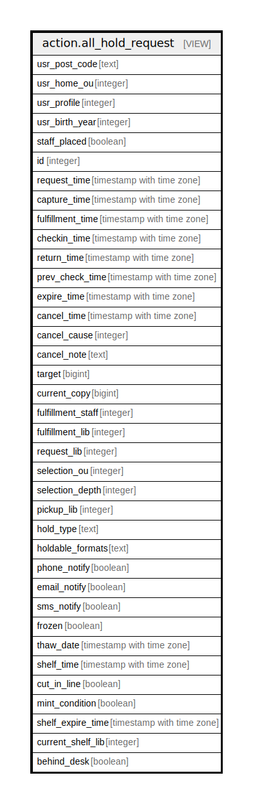

# action.all_hold_request

## Description

<details>
<summary><strong>Table Definition</strong></summary>

```sql
CREATE VIEW all_hold_request AS (
 SELECT DISTINCT COALESCE(a.post_code, b.post_code) AS usr_post_code,
    p.home_ou AS usr_home_ou,
    p.profile AS usr_profile,
    (date_part('year'::text, p.dob))::integer AS usr_birth_year,
    (ahr.requestor <> ahr.usr) AS staff_placed,
    ahr.id,
    ahr.request_time,
    ahr.capture_time,
    ahr.fulfillment_time,
    ahr.checkin_time,
    ahr.return_time,
    ahr.prev_check_time,
    ahr.expire_time,
    ahr.cancel_time,
    ahr.cancel_cause,
    ahr.cancel_note,
    ahr.target,
    ahr.current_copy,
    ahr.fulfillment_staff,
    ahr.fulfillment_lib,
    ahr.request_lib,
    ahr.selection_ou,
    ahr.selection_depth,
    ahr.pickup_lib,
    ahr.hold_type,
    ahr.holdable_formats,
        CASE
            WHEN (ahr.phone_notify IS NULL) THEN false
            WHEN (ahr.phone_notify = ''::text) THEN false
            ELSE true
        END AS phone_notify,
    ahr.email_notify,
        CASE
            WHEN (ahr.sms_notify IS NULL) THEN false
            WHEN (ahr.sms_notify = ''::text) THEN false
            ELSE true
        END AS sms_notify,
    ahr.frozen,
    ahr.thaw_date,
    ahr.shelf_time,
    ahr.cut_in_line,
    ahr.mint_condition,
    ahr.shelf_expire_time,
    ahr.current_shelf_lib,
    ahr.behind_desk
   FROM (((action.hold_request ahr
     JOIN actor.usr p ON ((ahr.usr = p.id)))
     LEFT JOIN actor.usr_address a ON ((p.mailing_address = a.id)))
     LEFT JOIN actor.usr_address b ON ((p.billing_address = b.id)))
UNION ALL
 SELECT aged_hold_request.usr_post_code,
    aged_hold_request.usr_home_ou,
    aged_hold_request.usr_profile,
    aged_hold_request.usr_birth_year,
    aged_hold_request.staff_placed,
    aged_hold_request.id,
    aged_hold_request.request_time,
    aged_hold_request.capture_time,
    aged_hold_request.fulfillment_time,
    aged_hold_request.checkin_time,
    aged_hold_request.return_time,
    aged_hold_request.prev_check_time,
    aged_hold_request.expire_time,
    aged_hold_request.cancel_time,
    aged_hold_request.cancel_cause,
    aged_hold_request.cancel_note,
    aged_hold_request.target,
    aged_hold_request.current_copy,
    aged_hold_request.fulfillment_staff,
    aged_hold_request.fulfillment_lib,
    aged_hold_request.request_lib,
    aged_hold_request.selection_ou,
    aged_hold_request.selection_depth,
    aged_hold_request.pickup_lib,
    aged_hold_request.hold_type,
    aged_hold_request.holdable_formats,
    aged_hold_request.phone_notify,
    aged_hold_request.email_notify,
    aged_hold_request.sms_notify,
    aged_hold_request.frozen,
    aged_hold_request.thaw_date,
    aged_hold_request.shelf_time,
    aged_hold_request.cut_in_line,
    aged_hold_request.mint_condition,
    aged_hold_request.shelf_expire_time,
    aged_hold_request.current_shelf_lib,
    aged_hold_request.behind_desk
   FROM action.aged_hold_request
)
```

</details>

## Columns

| Name | Type | Default | Nullable | Children | Parents | Comment |
| ---- | ---- | ------- | -------- | -------- | ------- | ------- |
| usr_post_code | text |  | true |  |  |  |
| usr_home_ou | integer |  | true |  |  |  |
| usr_profile | integer |  | true |  |  |  |
| usr_birth_year | integer |  | true |  |  |  |
| staff_placed | boolean |  | true |  |  |  |
| id | integer |  | true |  |  |  |
| request_time | timestamp with time zone |  | true |  |  |  |
| capture_time | timestamp with time zone |  | true |  |  |  |
| fulfillment_time | timestamp with time zone |  | true |  |  |  |
| checkin_time | timestamp with time zone |  | true |  |  |  |
| return_time | timestamp with time zone |  | true |  |  |  |
| prev_check_time | timestamp with time zone |  | true |  |  |  |
| expire_time | timestamp with time zone |  | true |  |  |  |
| cancel_time | timestamp with time zone |  | true |  |  |  |
| cancel_cause | integer |  | true |  |  |  |
| cancel_note | text |  | true |  |  |  |
| target | bigint |  | true |  |  |  |
| current_copy | bigint |  | true |  |  |  |
| fulfillment_staff | integer |  | true |  |  |  |
| fulfillment_lib | integer |  | true |  |  |  |
| request_lib | integer |  | true |  |  |  |
| selection_ou | integer |  | true |  |  |  |
| selection_depth | integer |  | true |  |  |  |
| pickup_lib | integer |  | true |  |  |  |
| hold_type | text |  | true |  |  |  |
| holdable_formats | text |  | true |  |  |  |
| phone_notify | boolean |  | true |  |  |  |
| email_notify | boolean |  | true |  |  |  |
| sms_notify | boolean |  | true |  |  |  |
| frozen | boolean |  | true |  |  |  |
| thaw_date | timestamp with time zone |  | true |  |  |  |
| shelf_time | timestamp with time zone |  | true |  |  |  |
| cut_in_line | boolean |  | true |  |  |  |
| mint_condition | boolean |  | true |  |  |  |
| shelf_expire_time | timestamp with time zone |  | true |  |  |  |
| current_shelf_lib | integer |  | true |  |  |  |
| behind_desk | boolean |  | true |  |  |  |

## Referenced Tables

| Name | Columns | Comment | Type |
| ---- | ------- | ------- | ---- |
| [action.hold_request](action.hold_request.md) | 37 |  | BASE TABLE |
| [actor.usr](actor.usr.md) | 49 | <br>User objects<br><br>This table contains the core User objects that describe both<br>staff members and patrons.  The difference between the two<br>types of users is based on the user's permissions.<br> | BASE TABLE |
| [actor.usr_address](actor.usr_address.md) | 14 |  | BASE TABLE |
| [action.aged_hold_request](action.aged_hold_request.md) | 37 |  | BASE TABLE |

## Relations



---

> Generated by [tbls](https://github.com/k1LoW/tbls)
