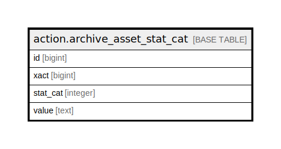

# action.archive_asset_stat_cat

## Description

## Columns

| Name | Type | Default | Nullable | Children | Parents | Comment |
| ---- | ---- | ------- | -------- | -------- | ------- | ------- |
| id | bigint | nextval('action.archive_asset_stat_cat_id_seq'::regclass) | false |  |  |  |
| xact | bigint |  | false |  |  |  |
| stat_cat | integer |  | false |  |  |  |
| value | text |  | false |  |  |  |

## Constraints

| Name | Type | Definition |
| ---- | ---- | ---------- |
| archive_asset_stat_cat_pkey | PRIMARY KEY | PRIMARY KEY (id) |

## Indexes

| Name | Definition |
| ---- | ---------- |
| archive_asset_stat_cat_pkey | CREATE UNIQUE INDEX archive_asset_stat_cat_pkey ON action.archive_asset_stat_cat USING btree (id) |

## Relations

---

> Generated by [tbls](https://github.com/k1LoW/tbls)
