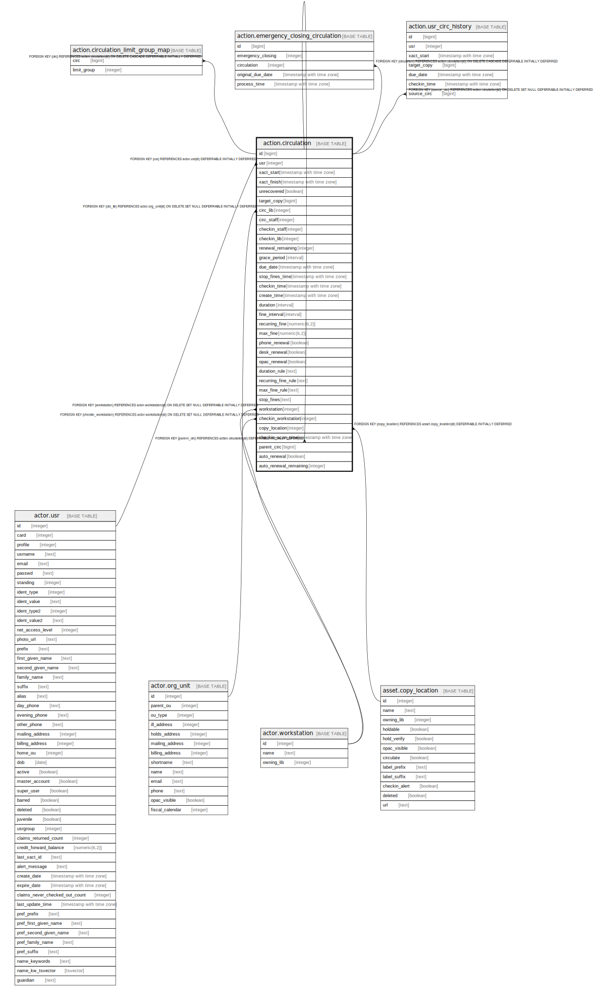

# action.circulation

## Description

## Columns

| Name | Type | Default | Nullable | Children | Parents | Comment |
| ---- | ---- | ------- | -------- | -------- | ------- | ------- |
| id | bigint | nextval('money.billable_xact_id_seq'::regclass) | false | [action.circulation](action.circulation.md) [action.circulation_limit_group_map](action.circulation_limit_group_map.md) [action.emergency_closing_circulation](action.emergency_closing_circulation.md) [action.usr_circ_history](action.usr_circ_history.md) |  |  |
| usr | integer |  | false |  | [actor.usr](actor.usr.md) |  |
| xact_start | timestamp with time zone | now() | false |  |  |  |
| xact_finish | timestamp with time zone |  | true |  |  |  |
| unrecovered | boolean |  | true |  |  |  |
| target_copy | bigint |  | false |  |  |  |
| circ_lib | integer |  | false |  | [actor.org_unit](actor.org_unit.md) |  |
| circ_staff | integer |  | false |  |  |  |
| checkin_staff | integer |  | true |  |  |  |
| checkin_lib | integer |  | true |  |  |  |
| renewal_remaining | integer |  | false |  |  |  |
| grace_period | interval |  | false |  |  |  |
| due_date | timestamp with time zone |  | true |  |  |  |
| stop_fines_time | timestamp with time zone |  | true |  |  |  |
| checkin_time | timestamp with time zone |  | true |  |  |  |
| create_time | timestamp with time zone | now() | false |  |  |  |
| duration | interval |  | true |  |  |  |
| fine_interval | interval | '1 day'::interval | false |  |  |  |
| recurring_fine | numeric(6,2) |  | true |  |  |  |
| max_fine | numeric(6,2) |  | true |  |  |  |
| phone_renewal | boolean | false | false |  |  |  |
| desk_renewal | boolean | false | false |  |  |  |
| opac_renewal | boolean | false | false |  |  |  |
| duration_rule | text |  | false |  |  |  |
| recurring_fine_rule | text |  | false |  |  |  |
| max_fine_rule | text |  | false |  |  |  |
| stop_fines | text |  | true |  |  |  |
| workstation | integer |  | true |  | [actor.workstation](actor.workstation.md) |  |
| checkin_workstation | integer |  | true |  | [actor.workstation](actor.workstation.md) |  |
| copy_location | integer | 1 | false |  | [asset.copy_location](asset.copy_location.md) |  |
| checkin_scan_time | timestamp with time zone |  | true |  |  |  |
| parent_circ | bigint |  | true |  | [action.circulation](action.circulation.md) |  |
| auto_renewal | boolean | false | false |  |  |  |
| auto_renewal_remaining | integer |  | true |  |  |  |

## Constraints

| Name | Type | Definition |
| ---- | ---- | ---------- |
| circulation_stop_fines_check | CHECK | CHECK ((stop_fines = ANY (ARRAY['CHECKIN'::text, 'CLAIMSRETURNED'::text, 'LOST'::text, 'MAXFINES'::text, 'RENEW'::text, 'LONGOVERDUE'::text, 'CLAIMSNEVERCHECKEDOUT'::text]))) |
| circulation_parent_circ_fkey | FOREIGN KEY | FOREIGN KEY (parent_circ) REFERENCES action.circulation(id) DEFERRABLE INITIALLY DEFERRED |
| circulation_pkey | PRIMARY KEY | PRIMARY KEY (id) |
| action_circulation_circ_lib_fkey | FOREIGN KEY | FOREIGN KEY (circ_lib) REFERENCES actor.org_unit(id) ON DELETE SET NULL DEFERRABLE INITIALLY DEFERRED |
| action_circulation_usr_fkey | FOREIGN KEY | FOREIGN KEY (usr) REFERENCES actor.usr(id) DEFERRABLE INITIALLY DEFERRED |
| circulation_checkin_workstation_fkey | FOREIGN KEY | FOREIGN KEY (checkin_workstation) REFERENCES actor.workstation(id) ON DELETE SET NULL DEFERRABLE INITIALLY DEFERRED |
| circulation_workstation_fkey | FOREIGN KEY | FOREIGN KEY (workstation) REFERENCES actor.workstation(id) ON DELETE SET NULL DEFERRABLE INITIALLY DEFERRED |
| circulation_copy_location_fkey | FOREIGN KEY | FOREIGN KEY (copy_location) REFERENCES asset.copy_location(id) DEFERRABLE INITIALLY DEFERRED |

## Indexes

| Name | Definition |
| ---- | ---------- |
| circulation_pkey | CREATE UNIQUE INDEX circulation_pkey ON action.circulation USING btree (id) |
| action_circulation_target_copy_idx | CREATE INDEX action_circulation_target_copy_idx ON action.circulation USING btree (target_copy) |
| circ_all_usr_idx | CREATE INDEX circ_all_usr_idx ON action.circulation USING btree (usr) |
| circ_checkin_staff_idx | CREATE INDEX circ_checkin_staff_idx ON action.circulation USING btree (checkin_staff) |
| circ_checkin_time | CREATE INDEX circ_checkin_time ON action.circulation USING btree (checkin_time) WHERE (checkin_time IS NOT NULL) |
| circ_circ_lib_idx | CREATE INDEX circ_circ_lib_idx ON action.circulation USING btree (circ_lib) |
| circ_circ_staff_idx | CREATE INDEX circ_circ_staff_idx ON action.circulation USING btree (circ_staff) |
| circ_open_date_idx | CREATE INDEX circ_open_date_idx ON action.circulation USING btree (xact_start) WHERE (xact_finish IS NULL) |
| circ_open_xacts_idx | CREATE INDEX circ_open_xacts_idx ON action.circulation USING btree (usr) WHERE (xact_finish IS NULL) |
| circ_outstanding_idx | CREATE INDEX circ_outstanding_idx ON action.circulation USING btree (usr) WHERE (checkin_time IS NULL) |
| circ_parent_idx | CREATE UNIQUE INDEX circ_parent_idx ON action.circulation USING btree (parent_circ) WHERE (parent_circ IS NOT NULL) |
| only_one_concurrent_checkout_per_copy | CREATE UNIQUE INDEX only_one_concurrent_checkout_per_copy ON action.circulation USING btree (target_copy) WHERE (checkin_time IS NULL) |

## Triggers

| Name | Definition |
| ---- | ---------- |
| action_circulation_aging_tgr | CREATE TRIGGER action_circulation_aging_tgr BEFORE DELETE ON action.circulation FOR EACH ROW EXECUTE PROCEDURE action.age_circ_on_delete() |
| action_circulation_stop_fines_tgr | CREATE TRIGGER action_circulation_stop_fines_tgr BEFORE UPDATE ON action.circulation FOR EACH ROW EXECUTE PROCEDURE action.circulation_claims_returned() |
| action_circulation_target_copy_trig | CREATE TRIGGER action_circulation_target_copy_trig AFTER INSERT OR UPDATE ON action.circulation FOR EACH ROW EXECUTE PROCEDURE fake_fkey_tgr('target_copy') |
| age_parent_circ | CREATE TRIGGER age_parent_circ AFTER DELETE ON action.circulation FOR EACH ROW EXECUTE PROCEDURE action.age_parent_circ_on_delete() |
| archive_stat_cats_tgr | CREATE TRIGGER archive_stat_cats_tgr AFTER INSERT ON action.circulation FOR EACH ROW EXECUTE PROCEDURE action.archive_stat_cats() |
| fill_circ_copy_location_tgr | CREATE TRIGGER fill_circ_copy_location_tgr BEFORE INSERT ON action.circulation FOR EACH ROW EXECUTE PROCEDURE action.fill_circ_copy_location() |
| maintain_usr_circ_history_tgr | CREATE TRIGGER maintain_usr_circ_history_tgr AFTER INSERT OR UPDATE ON action.circulation FOR EACH ROW EXECUTE PROCEDURE action.maintain_usr_circ_history() |
| mat_summary_change_tgr | CREATE TRIGGER mat_summary_change_tgr AFTER UPDATE ON action.circulation FOR EACH ROW EXECUTE PROCEDURE money.mat_summary_update() |
| mat_summary_create_tgr | CREATE TRIGGER mat_summary_create_tgr AFTER INSERT ON action.circulation FOR EACH ROW EXECUTE PROCEDURE money.mat_summary_create('circulation') |
| mat_summary_remove_tgr | CREATE TRIGGER mat_summary_remove_tgr AFTER DELETE ON action.circulation FOR EACH ROW EXECUTE PROCEDURE money.mat_summary_delete() |
| push_due_date_tgr | CREATE TRIGGER push_due_date_tgr BEFORE INSERT OR UPDATE ON action.circulation FOR EACH ROW EXECUTE PROCEDURE action.push_circ_due_time() |

## Relations

---

> Generated by [tbls](https://github.com/k1LoW/tbls)
