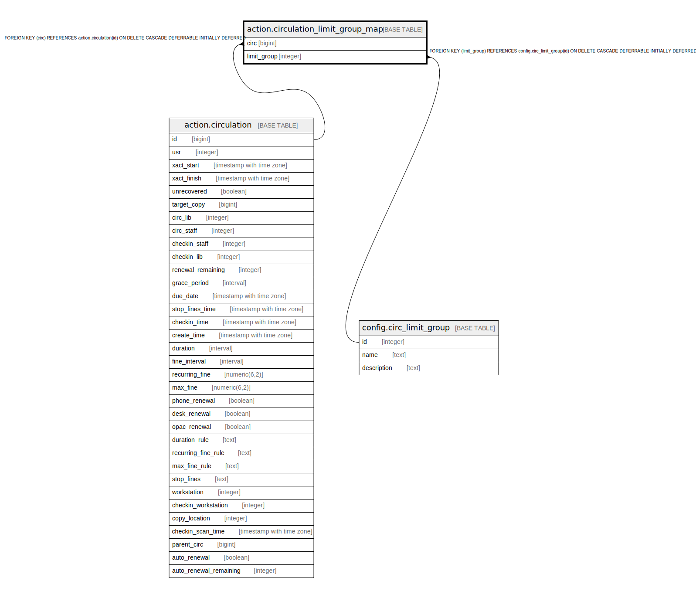

# action.circulation_limit_group_map

## Description

## Columns

| Name | Type | Default | Nullable | Children | Parents | Comment |
| ---- | ---- | ------- | -------- | -------- | ------- | ------- |
| circ | bigint |  | false |  | [action.circulation](action.circulation.md) |  |
| limit_group | integer |  | false |  | [config.circ_limit_group](config.circ_limit_group.md) |  |

## Constraints

| Name | Type | Definition |
| ---- | ---- | ---------- |
| circulation_limit_group_map_pkey | PRIMARY KEY | PRIMARY KEY (circ, limit_group) |
| circulation_limit_group_map_circ_fkey | FOREIGN KEY | FOREIGN KEY (circ) REFERENCES action.circulation(id) ON DELETE CASCADE DEFERRABLE INITIALLY DEFERRED |
| circulation_limit_group_map_limit_group_fkey | FOREIGN KEY | FOREIGN KEY (limit_group) REFERENCES config.circ_limit_group(id) ON DELETE CASCADE DEFERRABLE INITIALLY DEFERRED |

## Indexes

| Name | Definition |
| ---- | ---------- |
| circulation_limit_group_map_pkey | CREATE UNIQUE INDEX circulation_limit_group_map_pkey ON action.circulation_limit_group_map USING btree (circ, limit_group) |

## Relations

---

> Generated by [tbls](https://github.com/k1LoW/tbls)
