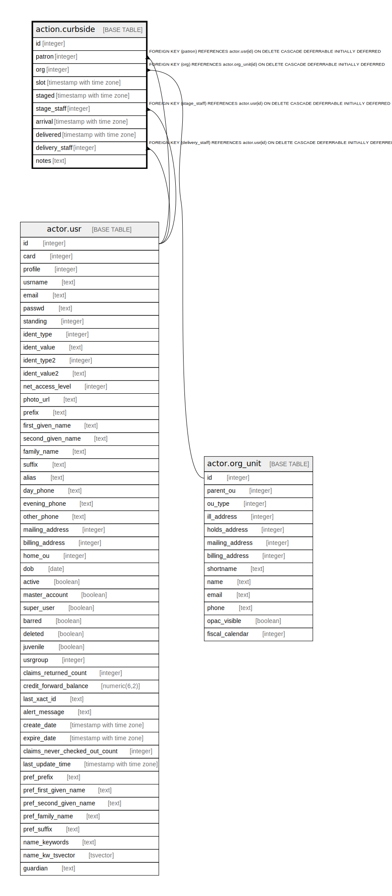

# action.curbside

## Description

## Columns

| Name | Type | Default | Nullable | Children | Parents | Comment |
| ---- | ---- | ------- | -------- | -------- | ------- | ------- |
| id | integer | nextval('action.curbside_id_seq'::regclass) | false |  |  |  |
| patron | integer |  | false |  | [actor.usr](actor.usr.md) |  |
| org | integer |  | false |  | [actor.org_unit](actor.org_unit.md) |  |
| slot | timestamp with time zone |  | true |  |  |  |
| staged | timestamp with time zone |  | true |  |  |  |
| stage_staff | integer |  | true |  | [actor.usr](actor.usr.md) |  |
| arrival | timestamp with time zone |  | true |  |  |  |
| delivered | timestamp with time zone |  | true |  |  |  |
| delivery_staff | integer |  | true |  | [actor.usr](actor.usr.md) |  |
| notes | text |  | true |  |  |  |

## Constraints

| Name | Type | Definition |
| ---- | ---- | ---------- |
| curbside_pkey | PRIMARY KEY | PRIMARY KEY (id) |
| curbside_org_fkey | FOREIGN KEY | FOREIGN KEY (org) REFERENCES actor.org_unit(id) ON DELETE CASCADE DEFERRABLE INITIALLY DEFERRED |
| curbside_delivery_staff_fkey | FOREIGN KEY | FOREIGN KEY (delivery_staff) REFERENCES actor.usr(id) ON DELETE CASCADE DEFERRABLE INITIALLY DEFERRED |
| curbside_patron_fkey | FOREIGN KEY | FOREIGN KEY (patron) REFERENCES actor.usr(id) ON DELETE CASCADE DEFERRABLE INITIALLY DEFERRED |
| curbside_stage_staff_fkey | FOREIGN KEY | FOREIGN KEY (stage_staff) REFERENCES actor.usr(id) ON DELETE CASCADE DEFERRABLE INITIALLY DEFERRED |

## Indexes

| Name | Definition |
| ---- | ---------- |
| curbside_pkey | CREATE UNIQUE INDEX curbside_pkey ON action.curbside USING btree (id) |

## Relations

---

> Generated by [tbls](https://github.com/k1LoW/tbls)
