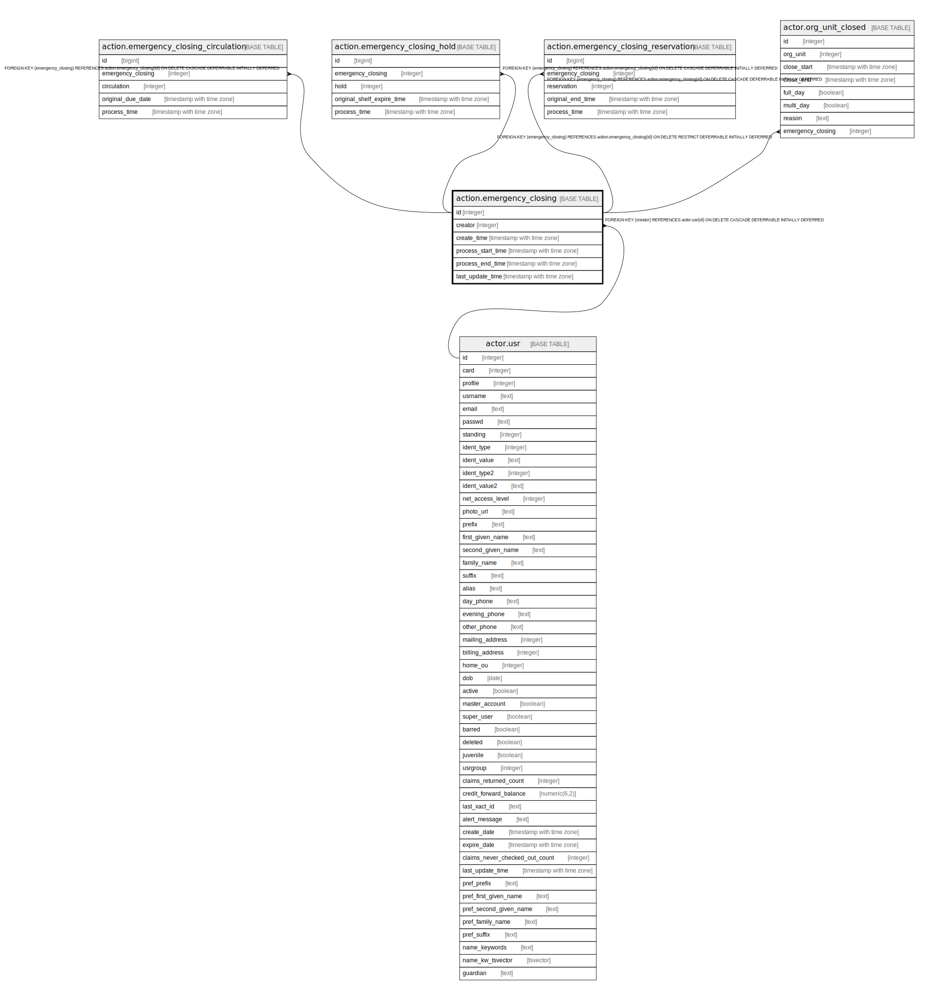

# action.emergency_closing

## Description

## Columns

| Name | Type | Default | Nullable | Children | Parents | Comment |
| ---- | ---- | ------- | -------- | -------- | ------- | ------- |
| id | integer | nextval('action.emergency_closing_id_seq'::regclass) | false | [action.emergency_closing_circulation](action.emergency_closing_circulation.md) [action.emergency_closing_hold](action.emergency_closing_hold.md) [action.emergency_closing_reservation](action.emergency_closing_reservation.md) [actor.org_unit_closed](actor.org_unit_closed.md) |  |  |
| creator | integer |  | false |  | [actor.usr](actor.usr.md) |  |
| create_time | timestamp with time zone | now() | false |  |  |  |
| process_start_time | timestamp with time zone |  | true |  |  |  |
| process_end_time | timestamp with time zone |  | true |  |  |  |
| last_update_time | timestamp with time zone |  | true |  |  |  |

## Constraints

| Name | Type | Definition |
| ---- | ---- | ---------- |
| emergency_closing_pkey | PRIMARY KEY | PRIMARY KEY (id) |
| emergency_closing_creator_fkey | FOREIGN KEY | FOREIGN KEY (creator) REFERENCES actor.usr(id) ON DELETE CASCADE DEFERRABLE INITIALLY DEFERRED |

## Indexes

| Name | Definition |
| ---- | ---------- |
| emergency_closing_pkey | CREATE UNIQUE INDEX emergency_closing_pkey ON action.emergency_closing USING btree (id) |

## Relations

---

> Generated by [tbls](https://github.com/k1LoW/tbls)
