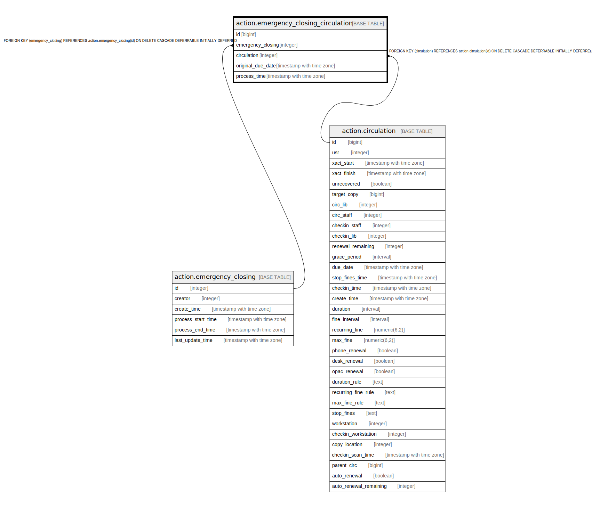

# action.emergency_closing_circulation

## Description

## Columns

| Name | Type | Default | Nullable | Children | Parents | Comment |
| ---- | ---- | ------- | -------- | -------- | ------- | ------- |
| id | bigint | nextval('action.emergency_closing_circulation_id_seq'::regclass) | false |  |  |  |
| emergency_closing | integer |  | false |  | [action.emergency_closing](action.emergency_closing.md) |  |
| circulation | integer |  | false |  | [action.circulation](action.circulation.md) |  |
| original_due_date | timestamp with time zone |  | true |  |  |  |
| process_time | timestamp with time zone |  | true |  |  |  |

## Constraints

| Name | Type | Definition |
| ---- | ---- | ---------- |
| emergency_closing_circulation_circulation_fkey | FOREIGN KEY | FOREIGN KEY (circulation) REFERENCES action.circulation(id) ON DELETE CASCADE DEFERRABLE INITIALLY DEFERRED |
| emergency_closing_circulation_pkey | PRIMARY KEY | PRIMARY KEY (id) |
| emergency_closing_circulation_emergency_closing_fkey | FOREIGN KEY | FOREIGN KEY (emergency_closing) REFERENCES action.emergency_closing(id) ON DELETE CASCADE DEFERRABLE INITIALLY DEFERRED |

## Indexes

| Name | Definition |
| ---- | ---------- |
| emergency_closing_circulation_pkey | CREATE UNIQUE INDEX emergency_closing_circulation_pkey ON action.emergency_closing_circulation USING btree (id) |
| emergency_closing_circulation_circulation_idx | CREATE INDEX emergency_closing_circulation_circulation_idx ON action.emergency_closing_circulation USING btree (circulation) |
| emergency_closing_circulation_emergency_closing_idx | CREATE INDEX emergency_closing_circulation_emergency_closing_idx ON action.emergency_closing_circulation USING btree (emergency_closing) |

## Relations

---

> Generated by [tbls](https://github.com/k1LoW/tbls)
