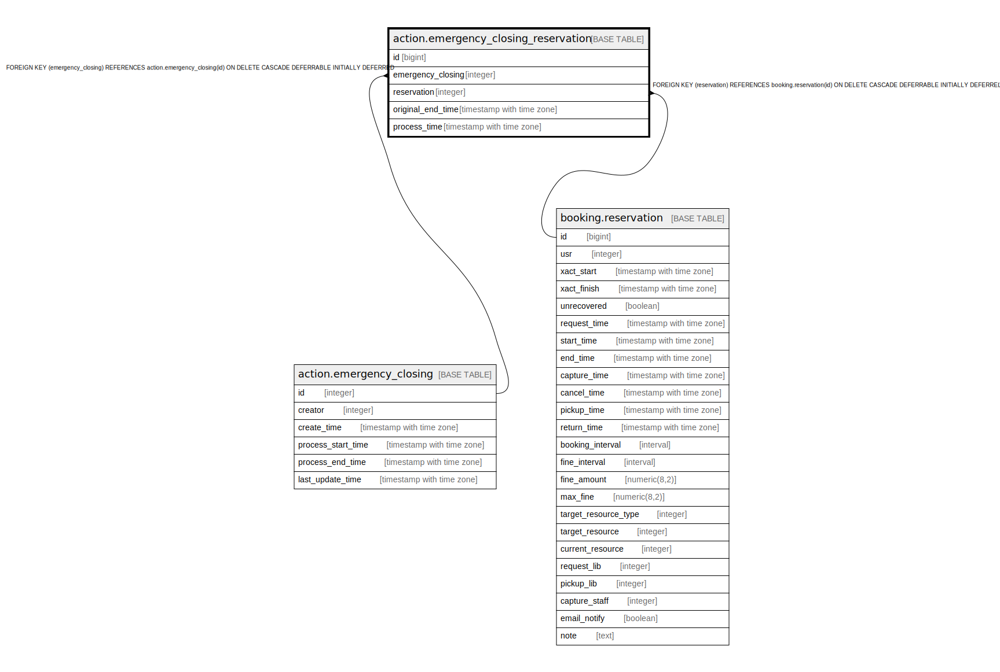

# action.emergency_closing_reservation

## Description

## Columns

| Name | Type | Default | Nullable | Children | Parents | Comment |
| ---- | ---- | ------- | -------- | -------- | ------- | ------- |
| id | bigint | nextval('action.emergency_closing_reservation_id_seq'::regclass) | false |  |  |  |
| emergency_closing | integer |  | false |  | [action.emergency_closing](action.emergency_closing.md) |  |
| reservation | integer |  | false |  | [booking.reservation](booking.reservation.md) |  |
| original_end_time | timestamp with time zone |  | true |  |  |  |
| process_time | timestamp with time zone |  | true |  |  |  |

## Constraints

| Name | Type | Definition |
| ---- | ---- | ---------- |
| emergency_closing_reservation_emergency_closing_fkey | FOREIGN KEY | FOREIGN KEY (emergency_closing) REFERENCES action.emergency_closing(id) ON DELETE CASCADE DEFERRABLE INITIALLY DEFERRED |
| emergency_closing_reservation_pkey | PRIMARY KEY | PRIMARY KEY (id) |
| emergency_closing_reservation_reservation_fkey | FOREIGN KEY | FOREIGN KEY (reservation) REFERENCES booking.reservation(id) ON DELETE CASCADE DEFERRABLE INITIALLY DEFERRED |

## Indexes

| Name | Definition |
| ---- | ---------- |
| emergency_closing_reservation_pkey | CREATE UNIQUE INDEX emergency_closing_reservation_pkey ON action.emergency_closing_reservation USING btree (id) |
| emergency_closing_reservation_emergency_closing_idx | CREATE INDEX emergency_closing_reservation_emergency_closing_idx ON action.emergency_closing_reservation USING btree (emergency_closing) |
| emergency_closing_reservation_reservation_idx | CREATE INDEX emergency_closing_reservation_reservation_idx ON action.emergency_closing_reservation USING btree (reservation) |

## Relations

---

> Generated by [tbls](https://github.com/k1LoW/tbls)
