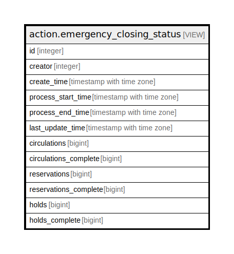

# action.emergency_closing_status

## Description

<details>
<summary><strong>Table Definition</strong></summary>

```sql
CREATE VIEW emergency_closing_status AS (
 SELECT e.id,
    e.creator,
    e.create_time,
    e.process_start_time,
    e.process_end_time,
    e.last_update_time,
    COALESCE(c.count, (0)::bigint) AS circulations,
    COALESCE(c.completed, (0)::bigint) AS circulations_complete,
    COALESCE(b.count, (0)::bigint) AS reservations,
    COALESCE(b.completed, (0)::bigint) AS reservations_complete,
    COALESCE(h.count, (0)::bigint) AS holds,
    COALESCE(h.completed, (0)::bigint) AS holds_complete
   FROM (((action.emergency_closing e
     LEFT JOIN ( SELECT emergency_closing_circulation.emergency_closing,
            count(*) AS count,
            sum(((emergency_closing_circulation.process_time IS NOT NULL))::integer) AS completed
           FROM action.emergency_closing_circulation
          GROUP BY emergency_closing_circulation.emergency_closing) c ON ((c.emergency_closing = e.id)))
     LEFT JOIN ( SELECT emergency_closing_reservation.emergency_closing,
            count(*) AS count,
            sum(((emergency_closing_reservation.process_time IS NOT NULL))::integer) AS completed
           FROM action.emergency_closing_reservation
          GROUP BY emergency_closing_reservation.emergency_closing) b ON ((b.emergency_closing = e.id)))
     LEFT JOIN ( SELECT emergency_closing_hold.emergency_closing,
            count(*) AS count,
            sum(((emergency_closing_hold.process_time IS NOT NULL))::integer) AS completed
           FROM action.emergency_closing_hold
          GROUP BY emergency_closing_hold.emergency_closing) h ON ((h.emergency_closing = e.id)))
)
```

</details>

## Columns

| Name | Type | Default | Nullable | Children | Parents | Comment |
| ---- | ---- | ------- | -------- | -------- | ------- | ------- |
| id | integer |  | true |  |  |  |
| creator | integer |  | true |  |  |  |
| create_time | timestamp with time zone |  | true |  |  |  |
| process_start_time | timestamp with time zone |  | true |  |  |  |
| process_end_time | timestamp with time zone |  | true |  |  |  |
| last_update_time | timestamp with time zone |  | true |  |  |  |
| circulations | bigint |  | true |  |  |  |
| circulations_complete | bigint |  | true |  |  |  |
| reservations | bigint |  | true |  |  |  |
| reservations_complete | bigint |  | true |  |  |  |
| holds | bigint |  | true |  |  |  |
| holds_complete | bigint |  | true |  |  |  |

## Referenced Tables

| Name | Columns | Comment | Type |
| ---- | ------- | ------- | ---- |
| [action.emergency_closing](action.emergency_closing.md) | 6 |  | BASE TABLE |
| [action.emergency_closing_circulation](action.emergency_closing_circulation.md) | 5 |  | BASE TABLE |
| [action.emergency_closing_reservation](action.emergency_closing_reservation.md) | 5 |  | BASE TABLE |
| [action.emergency_closing_hold](action.emergency_closing_hold.md) | 5 |  | BASE TABLE |

## Relations



---

> Generated by [tbls](https://github.com/k1LoW/tbls)
