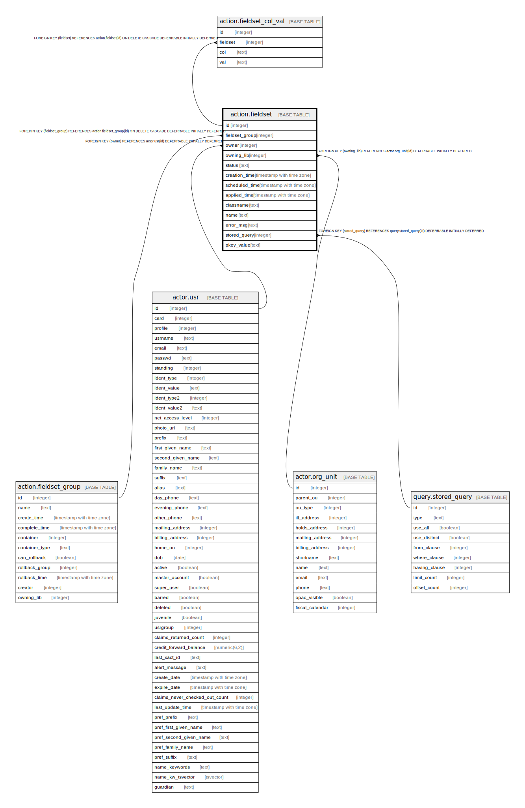

# action.fieldset

## Description

## Columns

| Name | Type | Default | Nullable | Children | Parents | Comment |
| ---- | ---- | ------- | -------- | -------- | ------- | ------- |
| id | integer | nextval('action.fieldset_id_seq'::regclass) | false | [action.fieldset_col_val](action.fieldset_col_val.md) |  |  |
| fieldset_group | integer |  | true |  | [action.fieldset_group](action.fieldset_group.md) |  |
| owner | integer |  | false |  | [actor.usr](actor.usr.md) |  |
| owning_lib | integer |  | false |  | [actor.org_unit](actor.org_unit.md) |  |
| status | text |  | false |  |  |  |
| creation_time | timestamp with time zone | now() | false |  |  |  |
| scheduled_time | timestamp with time zone |  | true |  |  |  |
| applied_time | timestamp with time zone |  | true |  |  |  |
| classname | text |  | false |  |  |  |
| name | text |  | false |  |  |  |
| error_msg | text |  | true |  |  |  |
| stored_query | integer |  | true |  | [query.stored_query](query.stored_query.md) |  |
| pkey_value | text |  | true |  |  |  |

## Constraints

| Name | Type | Definition |
| ---- | ---- | ---------- |
| fieldset_one_or_the_other | CHECK | CHECK ((((stored_query IS NOT NULL) AND (pkey_value IS NULL)) OR ((pkey_value IS NOT NULL) AND (stored_query IS NULL)))) |
| valid_status | CHECK | CHECK ((status = ANY (ARRAY['PENDING'::text, 'APPLIED'::text, 'ERROR'::text]))) |
| fieldset_fieldset_group_fkey | FOREIGN KEY | FOREIGN KEY (fieldset_group) REFERENCES action.fieldset_group(id) ON DELETE CASCADE DEFERRABLE INITIALLY DEFERRED |
| fieldset_pkey | PRIMARY KEY | PRIMARY KEY (id) |
| lib_name_unique | UNIQUE | UNIQUE (owning_lib, name) |
| fieldset_owning_lib_fkey | FOREIGN KEY | FOREIGN KEY (owning_lib) REFERENCES actor.org_unit(id) DEFERRABLE INITIALLY DEFERRED |
| fieldset_owner_fkey | FOREIGN KEY | FOREIGN KEY (owner) REFERENCES actor.usr(id) DEFERRABLE INITIALLY DEFERRED |
| fieldset_stored_query_fkey | FOREIGN KEY | FOREIGN KEY (stored_query) REFERENCES query.stored_query(id) DEFERRABLE INITIALLY DEFERRED |

## Indexes

| Name | Definition |
| ---- | ---------- |
| fieldset_pkey | CREATE UNIQUE INDEX fieldset_pkey ON action.fieldset USING btree (id) |
| lib_name_unique | CREATE UNIQUE INDEX lib_name_unique ON action.fieldset USING btree (owning_lib, name) |
| action_fieldset_sched_time_idx | CREATE INDEX action_fieldset_sched_time_idx ON action.fieldset USING btree (scheduled_time) |
| action_owner_idx | CREATE INDEX action_owner_idx ON action.fieldset USING btree (owner) |

## Relations

---

> Generated by [tbls](https://github.com/k1LoW/tbls)
