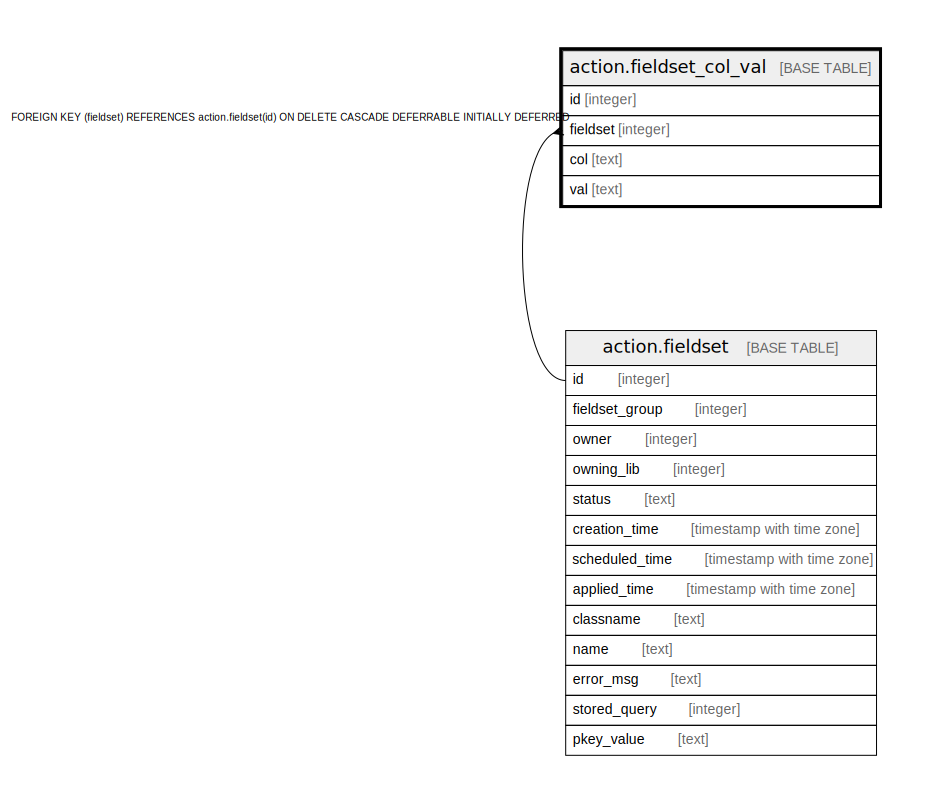

# action.fieldset_col_val

## Description

## Columns

| Name | Type | Default | Nullable | Children | Parents | Comment |
| ---- | ---- | ------- | -------- | -------- | ------- | ------- |
| id | integer | nextval('action.fieldset_col_val_id_seq'::regclass) | false |  |  |  |
| fieldset | integer |  | false |  | [action.fieldset](action.fieldset.md) |  |
| col | text |  | false |  |  |  |
| val | text |  | true |  |  |  |

## Constraints

| Name | Type | Definition |
| ---- | ---- | ---------- |
| fieldset_col_once_per_set | UNIQUE | UNIQUE (fieldset, col) |
| fieldset_col_val_pkey | PRIMARY KEY | PRIMARY KEY (id) |
| fieldset_col_val_fieldset_fkey | FOREIGN KEY | FOREIGN KEY (fieldset) REFERENCES action.fieldset(id) ON DELETE CASCADE DEFERRABLE INITIALLY DEFERRED |

## Indexes

| Name | Definition |
| ---- | ---------- |
| fieldset_col_once_per_set | CREATE UNIQUE INDEX fieldset_col_once_per_set ON action.fieldset_col_val USING btree (fieldset, col) |
| fieldset_col_val_pkey | CREATE UNIQUE INDEX fieldset_col_val_pkey ON action.fieldset_col_val USING btree (id) |

## Relations

---

> Generated by [tbls](https://github.com/k1LoW/tbls)
