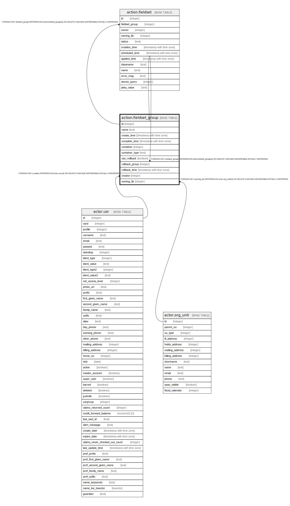

# action.fieldset_group

## Description

## Columns

| Name | Type | Default | Nullable | Children | Parents | Comment |
| ---- | ---- | ------- | -------- | -------- | ------- | ------- |
| id | integer | nextval('action.fieldset_group_id_seq'::regclass) | false | [action.fieldset](action.fieldset.md) [action.fieldset_group](action.fieldset_group.md) |  |  |
| name | text |  | false |  |  |  |
| create_time | timestamp with time zone | now() | false |  |  |  |
| complete_time | timestamp with time zone |  | true |  |  |  |
| container | integer |  | true |  |  |  |
| container_type | text |  | true |  |  |  |
| can_rollback | boolean | true | true |  |  |  |
| rollback_group | integer |  | true |  | [action.fieldset_group](action.fieldset_group.md) |  |
| rollback_time | timestamp with time zone |  | true |  |  |  |
| creator | integer |  | false |  | [actor.usr](actor.usr.md) |  |
| owning_lib | integer |  | false |  | [actor.org_unit](actor.org_unit.md) |  |

## Constraints

| Name | Type | Definition |
| ---- | ---- | ---------- |
| fieldset_group_pkey | PRIMARY KEY | PRIMARY KEY (id) |
| fieldset_group_rollback_group_fkey | FOREIGN KEY | FOREIGN KEY (rollback_group) REFERENCES action.fieldset_group(id) ON DELETE CASCADE DEFERRABLE INITIALLY DEFERRED |
| fieldset_group_owning_lib_fkey | FOREIGN KEY | FOREIGN KEY (owning_lib) REFERENCES actor.org_unit(id) ON DELETE CASCADE DEFERRABLE INITIALLY DEFERRED |
| fieldset_group_creator_fkey | FOREIGN KEY | FOREIGN KEY (creator) REFERENCES actor.usr(id) ON DELETE CASCADE DEFERRABLE INITIALLY DEFERRED |

## Indexes

| Name | Definition |
| ---- | ---------- |
| fieldset_group_pkey | CREATE UNIQUE INDEX fieldset_group_pkey ON action.fieldset_group USING btree (id) |

## Relations

---

> Generated by [tbls](https://github.com/k1LoW/tbls)
