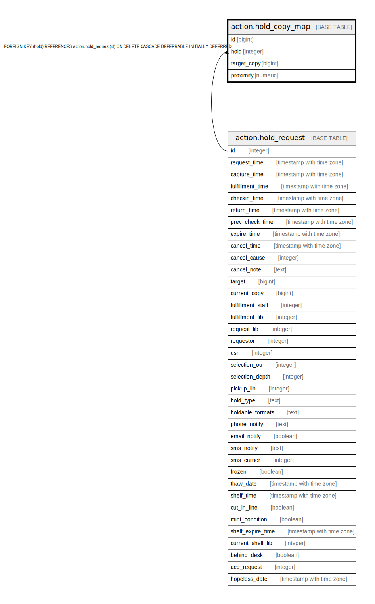

# action.hold_copy_map

## Description

## Columns

| Name | Type | Default | Nullable | Children | Parents | Comment |
| ---- | ---- | ------- | -------- | -------- | ------- | ------- |
| id | bigint | nextval('action.hold_copy_map_id_seq'::regclass) | false |  |  |  |
| hold | integer |  | false |  | [action.hold_request](action.hold_request.md) |  |
| target_copy | bigint |  | false |  |  |  |
| proximity | numeric |  | true |  |  |  |

## Constraints

| Name | Type | Definition |
| ---- | ---- | ---------- |
| copy_once_per_hold | UNIQUE | UNIQUE (hold, target_copy) |
| hold_copy_map_pkey | PRIMARY KEY | PRIMARY KEY (id) |
| hold_copy_map_hold_fkey | FOREIGN KEY | FOREIGN KEY (hold) REFERENCES action.hold_request(id) ON DELETE CASCADE DEFERRABLE INITIALLY DEFERRED |

## Indexes

| Name | Definition |
| ---- | ---------- |
| copy_once_per_hold | CREATE UNIQUE INDEX copy_once_per_hold ON action.hold_copy_map USING btree (hold, target_copy) |
| hold_copy_map_pkey | CREATE UNIQUE INDEX hold_copy_map_pkey ON action.hold_copy_map USING btree (id) |
| acm_copy_idx | CREATE INDEX acm_copy_idx ON action.hold_copy_map USING btree (target_copy) |

## Triggers

| Name | Definition |
| ---- | ---------- |
| hold_copy_proximity_update_tgr | CREATE TRIGGER hold_copy_proximity_update_tgr BEFORE INSERT OR UPDATE ON action.hold_copy_map FOR EACH ROW EXECUTE PROCEDURE action.hold_copy_calculated_proximity_update() |

## Relations

---

> Generated by [tbls](https://github.com/k1LoW/tbls)
