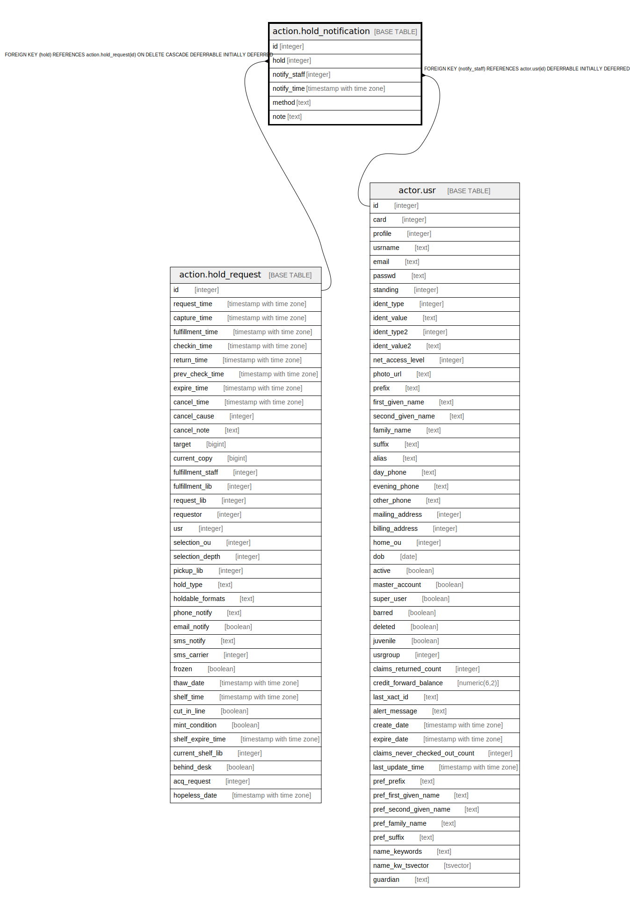

# action.hold_notification

## Description

## Columns

| Name | Type | Default | Nullable | Children | Parents | Comment |
| ---- | ---- | ------- | -------- | -------- | ------- | ------- |
| id | integer | nextval('action.hold_notification_id_seq'::regclass) | false |  |  |  |
| hold | integer |  | false |  | [action.hold_request](action.hold_request.md) |  |
| notify_staff | integer |  | true |  | [actor.usr](actor.usr.md) |  |
| notify_time | timestamp with time zone | now() | false |  |  |  |
| method | text |  | false |  |  |  |
| note | text |  | true |  |  |  |

## Constraints

| Name | Type | Definition |
| ---- | ---- | ---------- |
| hold_notification_pkey | PRIMARY KEY | PRIMARY KEY (id) |
| hold_notification_hold_fkey | FOREIGN KEY | FOREIGN KEY (hold) REFERENCES action.hold_request(id) ON DELETE CASCADE DEFERRABLE INITIALLY DEFERRED |
| hold_notification_notify_staff_fkey | FOREIGN KEY | FOREIGN KEY (notify_staff) REFERENCES actor.usr(id) DEFERRABLE INITIALLY DEFERRED |

## Indexes

| Name | Definition |
| ---- | ---------- |
| hold_notification_pkey | CREATE UNIQUE INDEX hold_notification_pkey ON action.hold_notification USING btree (id) |
| ahn_hold_idx | CREATE INDEX ahn_hold_idx ON action.hold_notification USING btree (hold) |
| ahn_notify_staff_idx | CREATE INDEX ahn_notify_staff_idx ON action.hold_notification USING btree (notify_staff) |

## Relations

---

> Generated by [tbls](https://github.com/k1LoW/tbls)
