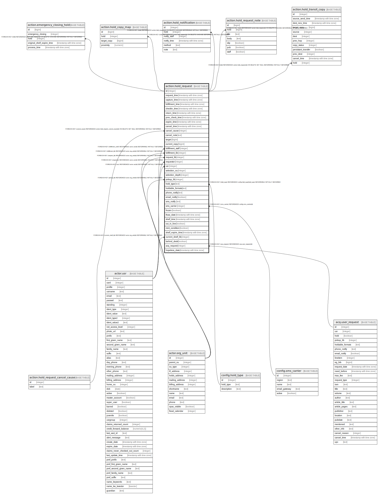

# action.hold_request

## Description

## Columns

| Name | Type | Default | Nullable | Children | Parents | Comment |
| ---- | ---- | ------- | -------- | -------- | ------- | ------- |
| id | integer | nextval('action.hold_request_id_seq'::regclass) | false | [action.emergency_closing_hold](action.emergency_closing_hold.md) [action.hold_copy_map](action.hold_copy_map.md) [action.hold_notification](action.hold_notification.md) [action.hold_request_note](action.hold_request_note.md) [action.hold_transit_copy](action.hold_transit_copy.md) |  |  |
| request_time | timestamp with time zone | now() | false |  |  |  |
| capture_time | timestamp with time zone |  | true |  |  |  |
| fulfillment_time | timestamp with time zone |  | true |  |  |  |
| checkin_time | timestamp with time zone |  | true |  |  |  |
| return_time | timestamp with time zone |  | true |  |  |  |
| prev_check_time | timestamp with time zone |  | true |  |  |  |
| expire_time | timestamp with time zone |  | true |  |  |  |
| cancel_time | timestamp with time zone |  | true |  |  |  |
| cancel_cause | integer |  | true |  | [action.hold_request_cancel_cause](action.hold_request_cancel_cause.md) |  |
| cancel_note | text |  | true |  |  |  |
| target | bigint |  | false |  |  |  |
| current_copy | bigint |  | true |  |  |  |
| fulfillment_staff | integer |  | true |  | [actor.usr](actor.usr.md) |  |
| fulfillment_lib | integer |  | true |  | [actor.org_unit](actor.org_unit.md) |  |
| request_lib | integer |  | false |  | [actor.org_unit](actor.org_unit.md) |  |
| requestor | integer |  | false |  | [actor.usr](actor.usr.md) |  |
| usr | integer |  | false |  | [actor.usr](actor.usr.md) |  |
| selection_ou | integer |  | false |  |  |  |
| selection_depth | integer | 0 | false |  |  |  |
| pickup_lib | integer |  | false |  | [actor.org_unit](actor.org_unit.md) |  |
| hold_type | text |  | false |  | [config.hold_type](config.hold_type.md) |  |
| holdable_formats | text |  | true |  |  |  |
| phone_notify | text |  | true |  |  |  |
| email_notify | boolean | false | false |  |  |  |
| sms_notify | text |  | true |  |  |  |
| sms_carrier | integer |  | true |  | [config.sms_carrier](config.sms_carrier.md) |  |
| frozen | boolean | false | false |  |  |  |
| thaw_date | timestamp with time zone |  | true |  |  |  |
| shelf_time | timestamp with time zone |  | true |  |  |  |
| cut_in_line | boolean |  | true |  |  |  |
| mint_condition | boolean | true | false |  |  |  |
| shelf_expire_time | timestamp with time zone |  | true |  |  |  |
| current_shelf_lib | integer |  | true |  | [actor.org_unit](actor.org_unit.md) |  |
| behind_desk | boolean | false | false |  |  |  |
| acq_request | integer |  | true |  | [acq.user_request](acq.user_request.md) |  |
| hopeless_date | timestamp with time zone |  | true |  |  |  |

## Constraints

| Name | Type | Definition |
| ---- | ---- | ---------- |
| sms_check | CHECK | CHECK (((sms_notify IS NULL) OR (sms_carrier IS NOT NULL))) |
| hold_request_acq_request_fkey | FOREIGN KEY | FOREIGN KEY (acq_request) REFERENCES acq.user_request(id) |
| hold_request_cancel_cause_fkey | FOREIGN KEY | FOREIGN KEY (cancel_cause) REFERENCES action.hold_request_cancel_cause(id) ON DELETE SET NULL DEFERRABLE INITIALLY DEFERRED |
| hold_request_pkey | PRIMARY KEY | PRIMARY KEY (id) |
| hold_request_current_shelf_lib_fkey | FOREIGN KEY | FOREIGN KEY (current_shelf_lib) REFERENCES actor.org_unit(id) DEFERRABLE INITIALLY DEFERRED |
| hold_request_fulfillment_lib_fkey | FOREIGN KEY | FOREIGN KEY (fulfillment_lib) REFERENCES actor.org_unit(id) DEFERRABLE INITIALLY DEFERRED |
| hold_request_pickup_lib_fkey | FOREIGN KEY | FOREIGN KEY (pickup_lib) REFERENCES actor.org_unit(id) DEFERRABLE INITIALLY DEFERRED |
| hold_request_request_lib_fkey | FOREIGN KEY | FOREIGN KEY (request_lib) REFERENCES actor.org_unit(id) DEFERRABLE INITIALLY DEFERRED |
| hold_request_fulfillment_staff_fkey | FOREIGN KEY | FOREIGN KEY (fulfillment_staff) REFERENCES actor.usr(id) DEFERRABLE INITIALLY DEFERRED |
| hold_request_requestor_fkey | FOREIGN KEY | FOREIGN KEY (requestor) REFERENCES actor.usr(id) DEFERRABLE INITIALLY DEFERRED |
| hold_request_usr_fkey | FOREIGN KEY | FOREIGN KEY (usr) REFERENCES actor.usr(id) DEFERRABLE INITIALLY DEFERRED |
| hold_request_hold_type_fkey | FOREIGN KEY | FOREIGN KEY (hold_type) REFERENCES config.hold_type(hold_type) DEFERRABLE INITIALLY DEFERRED |
| hold_request_sms_carrier_fkey | FOREIGN KEY | FOREIGN KEY (sms_carrier) REFERENCES config.sms_carrier(id) |

## Indexes

| Name | Definition |
| ---- | ---------- |
| hold_request_pkey | CREATE UNIQUE INDEX hold_request_pkey ON action.hold_request USING btree (id) |
| hold_fulfillment_time_idx | CREATE INDEX hold_fulfillment_time_idx ON action.hold_request USING btree (fulfillment_time) WHERE (fulfillment_time IS NOT NULL) |
| hold_request_capture_protect_idx | CREATE UNIQUE INDEX hold_request_capture_protect_idx ON action.hold_request USING btree (current_copy) WHERE ((current_copy IS NOT NULL) AND (capture_time IS NOT NULL) AND (cancel_time IS NULL) AND (fulfillment_time IS NULL)) |
| hold_request_copy_capture_time_idx | CREATE INDEX hold_request_copy_capture_time_idx ON action.hold_request USING btree (current_copy, capture_time) |
| hold_request_current_copy_before_cap_idx | CREATE INDEX hold_request_current_copy_before_cap_idx ON action.hold_request USING btree (current_copy) WHERE ((capture_time IS NULL) AND (cancel_time IS NULL)) |
| hold_request_current_copy_idx | CREATE INDEX hold_request_current_copy_idx ON action.hold_request USING btree (current_copy) |
| hold_request_fulfillment_staff_idx | CREATE INDEX hold_request_fulfillment_staff_idx ON action.hold_request USING btree (fulfillment_staff) |
| hold_request_open_captured_shelf_lib_idx | CREATE INDEX hold_request_open_captured_shelf_lib_idx ON action.hold_request USING btree (current_shelf_lib) WHERE ((capture_time IS NOT NULL) AND (fulfillment_time IS NULL) AND (pickup_lib <> current_shelf_lib)) |
| hold_request_open_idx | CREATE INDEX hold_request_open_idx ON action.hold_request USING btree (id) WHERE ((cancel_time IS NULL) AND (fulfillment_time IS NULL)) |
| hold_request_pickup_lib_idx | CREATE INDEX hold_request_pickup_lib_idx ON action.hold_request USING btree (pickup_lib) |
| hold_request_prev_check_time_idx | CREATE INDEX hold_request_prev_check_time_idx ON action.hold_request USING btree (prev_check_time) |
| hold_request_requestor_idx | CREATE INDEX hold_request_requestor_idx ON action.hold_request USING btree (requestor) |
| hold_request_target_idx | CREATE INDEX hold_request_target_idx ON action.hold_request USING btree (target) |
| hold_request_time_idx | CREATE INDEX hold_request_time_idx ON action.hold_request USING btree (request_time) |
| hold_request_usr_idx | CREATE INDEX hold_request_usr_idx ON action.hold_request USING btree (usr) |

## Triggers

| Name | Definition |
| ---- | ---------- |
| action_hold_request_aging_tgr | CREATE TRIGGER action_hold_request_aging_tgr BEFORE DELETE ON action.hold_request FOR EACH ROW EXECUTE PROCEDURE action.age_hold_on_delete() |
| hold_request_clear_map_tgr | CREATE TRIGGER hold_request_clear_map_tgr AFTER UPDATE ON action.hold_request FOR EACH ROW WHEN ((((new.cancel_time IS NOT NULL) AND (old.cancel_time IS NULL)) OR ((new.fulfillment_time IS NOT NULL) AND (old.fulfillment_time IS NULL)))) EXECUTE PROCEDURE action.hold_request_clear_map() |
| reporter_hold_request_record_trigger | CREATE TRIGGER reporter_hold_request_record_trigger AFTER INSERT OR UPDATE ON action.hold_request FOR EACH ROW EXECUTE PROCEDURE reporter.hold_request_record_mapper() |

## Relations

---

> Generated by [tbls](https://github.com/k1LoW/tbls)
