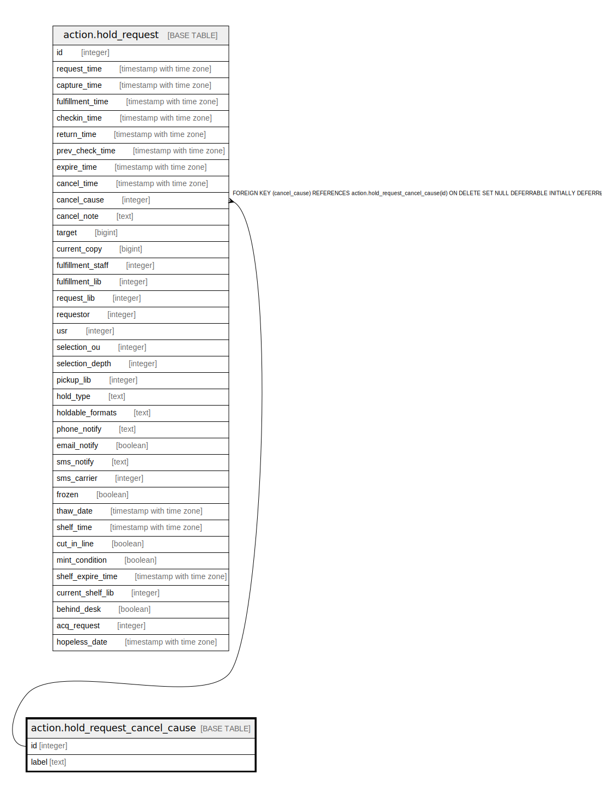

# action.hold_request_cancel_cause

## Description

## Columns

| Name | Type | Default | Nullable | Children | Parents | Comment |
| ---- | ---- | ------- | -------- | -------- | ------- | ------- |
| id | integer | nextval('action.hold_request_cancel_cause_id_seq'::regclass) | false | [action.hold_request](action.hold_request.md) |  |  |
| label | text |  | true |  |  |  |

## Constraints

| Name | Type | Definition |
| ---- | ---- | ---------- |
| hold_request_cancel_cause_label_key | UNIQUE | UNIQUE (label) |
| hold_request_cancel_cause_pkey | PRIMARY KEY | PRIMARY KEY (id) |

## Indexes

| Name | Definition |
| ---- | ---------- |
| hold_request_cancel_cause_label_key | CREATE UNIQUE INDEX hold_request_cancel_cause_label_key ON action.hold_request_cancel_cause USING btree (label) |
| hold_request_cancel_cause_pkey | CREATE UNIQUE INDEX hold_request_cancel_cause_pkey ON action.hold_request_cancel_cause USING btree (id) |

## Relations

---

> Generated by [tbls](https://github.com/k1LoW/tbls)
