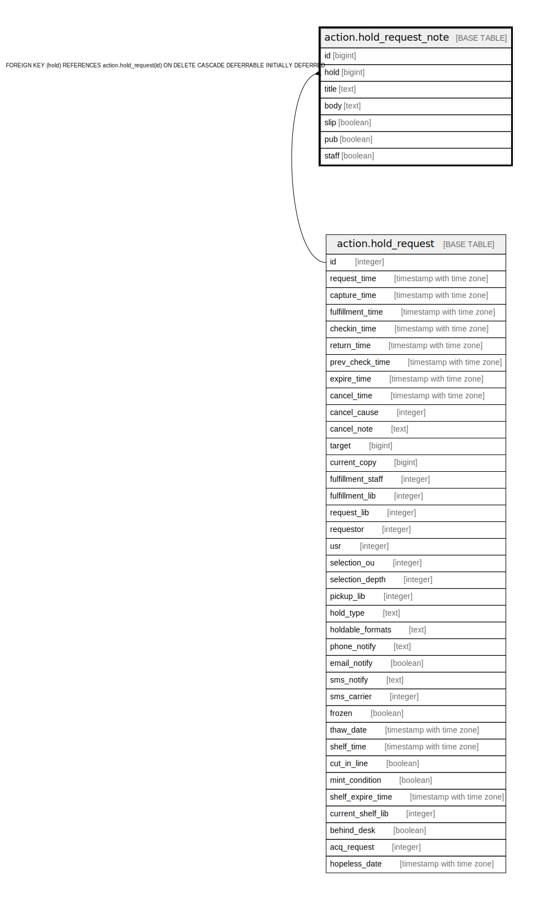

# action.hold_request_note

## Description

## Columns

| Name | Type | Default | Nullable | Children | Parents | Comment |
| ---- | ---- | ------- | -------- | -------- | ------- | ------- |
| id | bigint | nextval('action.hold_request_note_id_seq'::regclass) | false |  |  |  |
| hold | bigint |  | false |  | [action.hold_request](action.hold_request.md) |  |
| title | text |  | false |  |  |  |
| body | text |  | false |  |  |  |
| slip | boolean | false | false |  |  |  |
| pub | boolean | false | false |  |  |  |
| staff | boolean | false | false |  |  |  |

## Constraints

| Name | Type | Definition |
| ---- | ---- | ---------- |
| hold_request_note_pkey | PRIMARY KEY | PRIMARY KEY (id) |
| hold_request_note_hold_fkey | FOREIGN KEY | FOREIGN KEY (hold) REFERENCES action.hold_request(id) ON DELETE CASCADE DEFERRABLE INITIALLY DEFERRED |

## Indexes

| Name | Definition |
| ---- | ---------- |
| hold_request_note_pkey | CREATE UNIQUE INDEX hold_request_note_pkey ON action.hold_request_note USING btree (id) |
| ahrn_hold_idx | CREATE INDEX ahrn_hold_idx ON action.hold_request_note USING btree (hold) |

## Relations

---

> Generated by [tbls](https://github.com/k1LoW/tbls)
