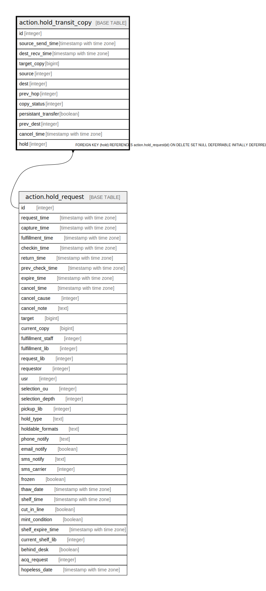

# action.hold_transit_copy

## Description

## Columns

| Name | Type | Default | Nullable | Children | Parents | Comment |
| ---- | ---- | ------- | -------- | -------- | ------- | ------- |
| id | integer | nextval('action.transit_copy_id_seq'::regclass) | false |  |  |  |
| source_send_time | timestamp with time zone |  | true |  |  |  |
| dest_recv_time | timestamp with time zone |  | true |  |  |  |
| target_copy | bigint |  | false |  |  |  |
| source | integer |  | false |  |  |  |
| dest | integer |  | false |  |  |  |
| prev_hop | integer |  | true |  |  |  |
| copy_status | integer |  | false |  |  |  |
| persistant_transfer | boolean | false | false |  |  |  |
| prev_dest | integer |  | true |  |  |  |
| cancel_time | timestamp with time zone |  | true |  |  |  |
| hold | integer |  | true |  | [action.hold_request](action.hold_request.md) |  |

## Constraints

| Name | Type | Definition |
| ---- | ---- | ---------- |
| hold_transit_copy_is_unique_check | TRIGGER | CREATE CONSTRAINT TRIGGER hold_transit_copy_is_unique_check AFTER INSERT ON action.hold_transit_copy NOT DEFERRABLE INITIALLY IMMEDIATE FOR EACH ROW EXECUTE PROCEDURE action.copy_transit_is_unique() |
| hold_transit_copy_hold_fkey | FOREIGN KEY | FOREIGN KEY (hold) REFERENCES action.hold_request(id) ON DELETE SET NULL DEFERRABLE INITIALLY DEFERRED |
| hold_transit_copy_pkey | PRIMARY KEY | PRIMARY KEY (id) |

## Indexes

| Name | Definition |
| ---- | ---------- |
| hold_transit_copy_pkey | CREATE UNIQUE INDEX hold_transit_copy_pkey ON action.hold_transit_copy USING btree (id) |
| active_hold_transit_cp_idx | CREATE INDEX active_hold_transit_cp_idx ON action.hold_transit_copy USING btree (target_copy) |
| active_hold_transit_dest_idx | CREATE INDEX active_hold_transit_dest_idx ON action.hold_transit_copy USING btree (dest) |
| active_hold_transit_source_idx | CREATE INDEX active_hold_transit_source_idx ON action.hold_transit_copy USING btree (source) |
| hold_transit_copy_hold_idx | CREATE INDEX hold_transit_copy_hold_idx ON action.hold_transit_copy USING btree (hold) |

## Triggers

| Name | Definition |
| ---- | ---------- |
| hold_transit_copy_is_unique_check | CREATE CONSTRAINT TRIGGER hold_transit_copy_is_unique_check AFTER INSERT ON action.hold_transit_copy NOT DEFERRABLE INITIALLY IMMEDIATE FOR EACH ROW EXECUTE PROCEDURE action.copy_transit_is_unique() |

## Relations

---

> Generated by [tbls](https://github.com/k1LoW/tbls)
