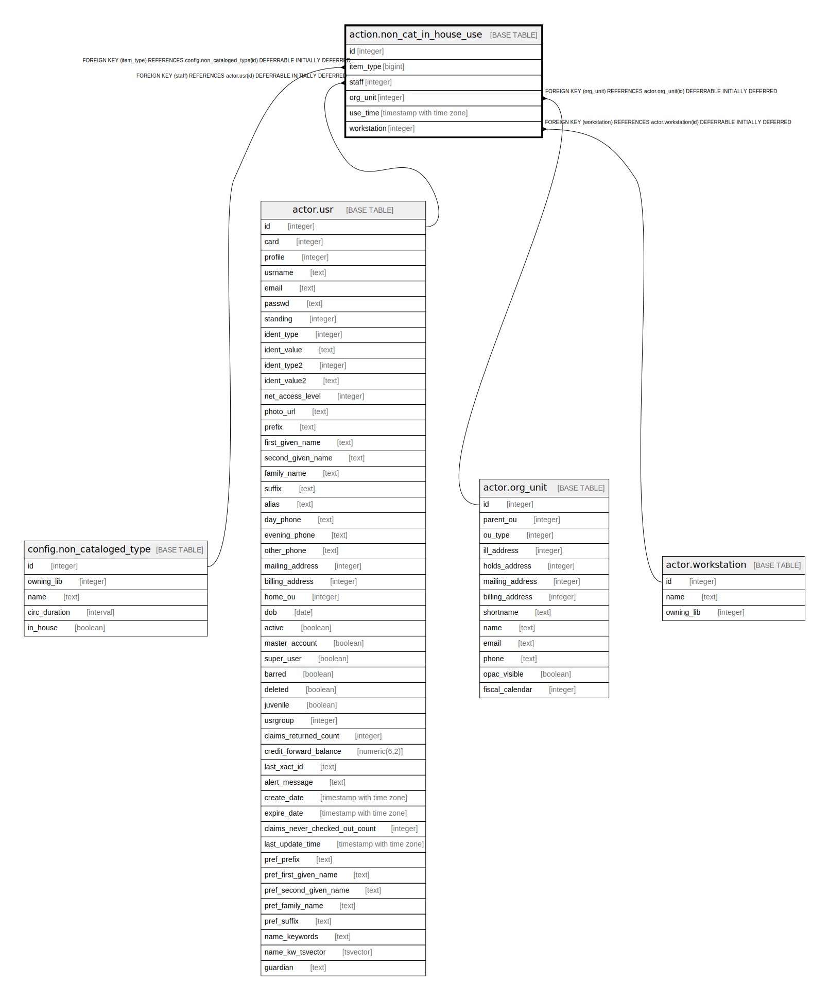

# action.non_cat_in_house_use

## Description

## Columns

| Name | Type | Default | Nullable | Children | Parents | Comment |
| ---- | ---- | ------- | -------- | -------- | ------- | ------- |
| id | integer | nextval('action.non_cat_in_house_use_id_seq'::regclass) | false |  |  |  |
| item_type | bigint |  | false |  | [config.non_cataloged_type](config.non_cataloged_type.md) |  |
| staff | integer |  | false |  | [actor.usr](actor.usr.md) |  |
| org_unit | integer |  | false |  | [actor.org_unit](actor.org_unit.md) |  |
| use_time | timestamp with time zone | now() | false |  |  |  |
| workstation | integer |  | true |  | [actor.workstation](actor.workstation.md) |  |

## Constraints

| Name | Type | Definition |
| ---- | ---- | ---------- |
| non_cat_in_house_use_pkey | PRIMARY KEY | PRIMARY KEY (id) |
| non_cat_in_house_use_org_unit_fkey | FOREIGN KEY | FOREIGN KEY (org_unit) REFERENCES actor.org_unit(id) DEFERRABLE INITIALLY DEFERRED |
| non_cat_in_house_use_staff_fkey | FOREIGN KEY | FOREIGN KEY (staff) REFERENCES actor.usr(id) DEFERRABLE INITIALLY DEFERRED |
| non_cat_in_house_use_workstation_fkey | FOREIGN KEY | FOREIGN KEY (workstation) REFERENCES actor.workstation(id) DEFERRABLE INITIALLY DEFERRED |
| non_cat_in_house_use_item_type_fkey | FOREIGN KEY | FOREIGN KEY (item_type) REFERENCES config.non_cataloged_type(id) DEFERRABLE INITIALLY DEFERRED |

## Indexes

| Name | Definition |
| ---- | ---------- |
| non_cat_in_house_use_pkey | CREATE UNIQUE INDEX non_cat_in_house_use_pkey ON action.non_cat_in_house_use USING btree (id) |
| non_cat_in_house_use_staff_idx | CREATE INDEX non_cat_in_house_use_staff_idx ON action.non_cat_in_house_use USING btree (staff) |
| non_cat_in_house_use_ws_idx | CREATE INDEX non_cat_in_house_use_ws_idx ON action.non_cat_in_house_use USING btree (workstation) |

## Relations

---

> Generated by [tbls](https://github.com/k1LoW/tbls)
