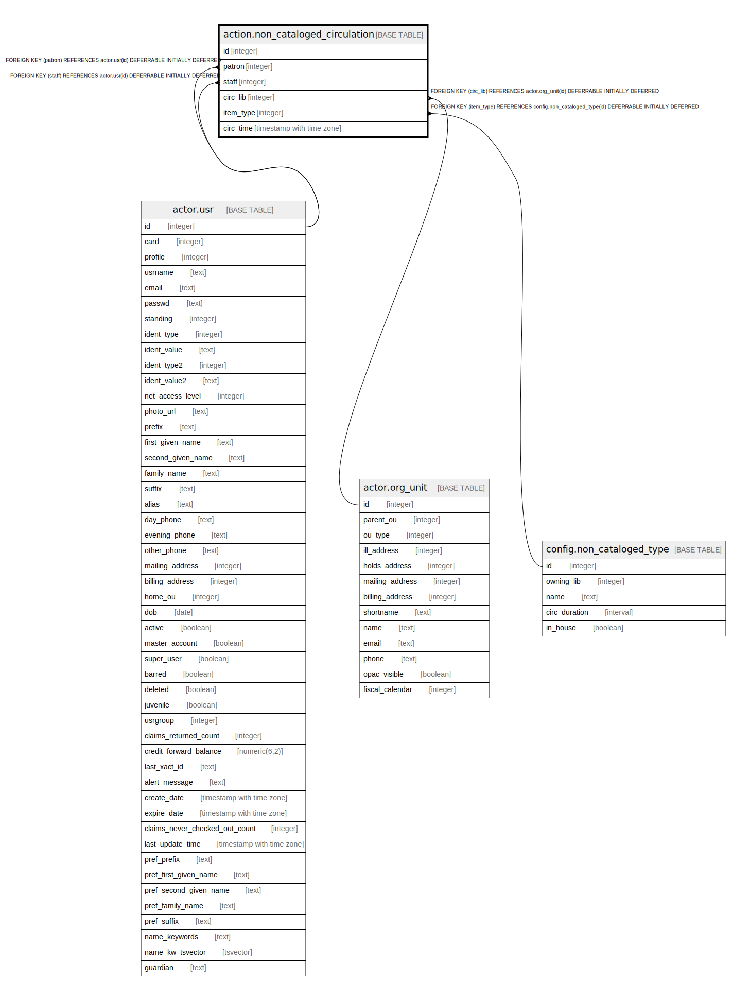

# action.non_cataloged_circulation

## Description

## Columns

| Name | Type | Default | Nullable | Children | Parents | Comment |
| ---- | ---- | ------- | -------- | -------- | ------- | ------- |
| id | integer | nextval('action.non_cataloged_circulation_id_seq'::regclass) | false |  |  |  |
| patron | integer |  | false |  | [actor.usr](actor.usr.md) |  |
| staff | integer |  | false |  | [actor.usr](actor.usr.md) |  |
| circ_lib | integer |  | false |  | [actor.org_unit](actor.org_unit.md) |  |
| item_type | integer |  | false |  | [config.non_cataloged_type](config.non_cataloged_type.md) |  |
| circ_time | timestamp with time zone | now() | false |  |  |  |

## Constraints

| Name | Type | Definition |
| ---- | ---- | ---------- |
| non_cataloged_circulation_pkey | PRIMARY KEY | PRIMARY KEY (id) |
| non_cataloged_circulation_circ_lib_fkey | FOREIGN KEY | FOREIGN KEY (circ_lib) REFERENCES actor.org_unit(id) DEFERRABLE INITIALLY DEFERRED |
| non_cataloged_circulation_patron_fkey | FOREIGN KEY | FOREIGN KEY (patron) REFERENCES actor.usr(id) DEFERRABLE INITIALLY DEFERRED |
| non_cataloged_circulation_staff_fkey | FOREIGN KEY | FOREIGN KEY (staff) REFERENCES actor.usr(id) DEFERRABLE INITIALLY DEFERRED |
| non_cataloged_circulation_item_type_fkey | FOREIGN KEY | FOREIGN KEY (item_type) REFERENCES config.non_cataloged_type(id) DEFERRABLE INITIALLY DEFERRED |

## Indexes

| Name | Definition |
| ---- | ---------- |
| non_cataloged_circulation_pkey | CREATE UNIQUE INDEX non_cataloged_circulation_pkey ON action.non_cataloged_circulation USING btree (id) |
| action_non_cat_circ_patron_idx | CREATE INDEX action_non_cat_circ_patron_idx ON action.non_cataloged_circulation USING btree (patron) |
| action_non_cat_circ_staff_idx | CREATE INDEX action_non_cat_circ_staff_idx ON action.non_cataloged_circulation USING btree (staff) |

## Relations

---

> Generated by [tbls](https://github.com/k1LoW/tbls)
