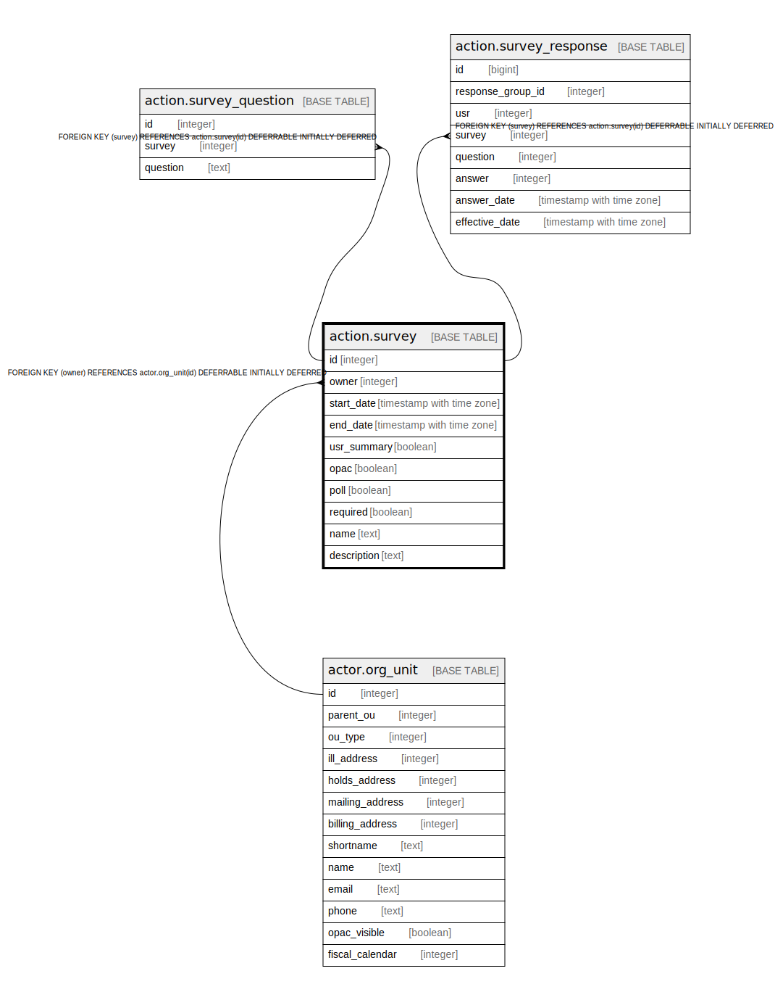

# action.survey

## Description

## Columns

| Name | Type | Default | Nullable | Children | Parents | Comment |
| ---- | ---- | ------- | -------- | -------- | ------- | ------- |
| id | integer | nextval('action.survey_id_seq'::regclass) | false | [action.survey_question](action.survey_question.md) [action.survey_response](action.survey_response.md) |  |  |
| owner | integer |  | false |  | [actor.org_unit](actor.org_unit.md) |  |
| start_date | timestamp with time zone | now() | false |  |  |  |
| end_date | timestamp with time zone | (now() + '10 years'::interval) | false |  |  |  |
| usr_summary | boolean | false | false |  |  |  |
| opac | boolean | false | false |  |  |  |
| poll | boolean | false | false |  |  |  |
| required | boolean | false | false |  |  |  |
| name | text |  | false |  |  |  |
| description | text |  | false |  |  |  |

## Constraints

| Name | Type | Definition |
| ---- | ---- | ---------- |
| survey_pkey | PRIMARY KEY | PRIMARY KEY (id) |
| survey_owner_fkey | FOREIGN KEY | FOREIGN KEY (owner) REFERENCES actor.org_unit(id) DEFERRABLE INITIALLY DEFERRED |

## Indexes

| Name | Definition |
| ---- | ---------- |
| survey_pkey | CREATE UNIQUE INDEX survey_pkey ON action.survey USING btree (id) |
| asv_once_per_owner_idx | CREATE UNIQUE INDEX asv_once_per_owner_idx ON action.survey USING btree (owner, name) |

## Relations

---

> Generated by [tbls](https://github.com/k1LoW/tbls)
