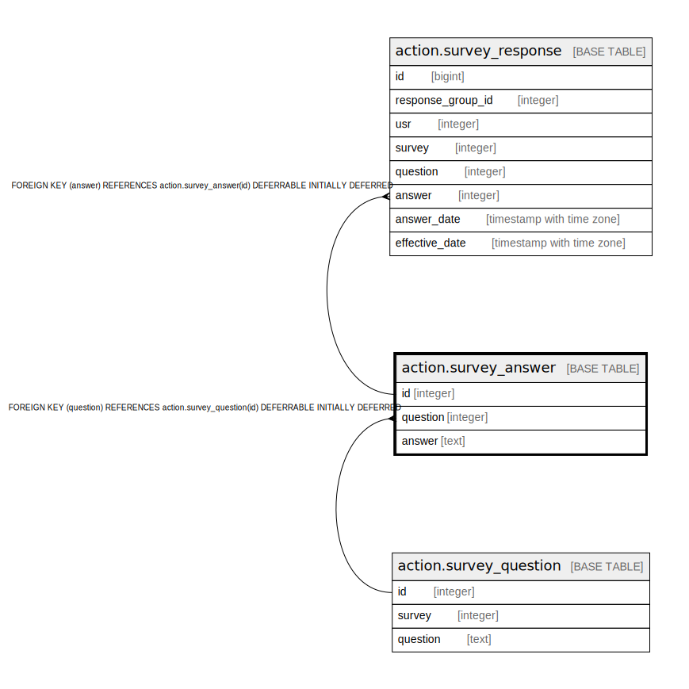

# action.survey_answer

## Description

## Columns

| Name | Type | Default | Nullable | Children | Parents | Comment |
| ---- | ---- | ------- | -------- | -------- | ------- | ------- |
| id | integer | nextval('action.survey_answer_id_seq'::regclass) | false | [action.survey_response](action.survey_response.md) |  |  |
| question | integer |  | false |  | [action.survey_question](action.survey_question.md) |  |
| answer | text |  | false |  |  |  |

## Constraints

| Name | Type | Definition |
| ---- | ---- | ---------- |
| survey_answer_pkey | PRIMARY KEY | PRIMARY KEY (id) |
| survey_answer_question_fkey | FOREIGN KEY | FOREIGN KEY (question) REFERENCES action.survey_question(id) DEFERRABLE INITIALLY DEFERRED |

## Indexes

| Name | Definition |
| ---- | ---------- |
| survey_answer_pkey | CREATE UNIQUE INDEX survey_answer_pkey ON action.survey_answer USING btree (id) |

## Relations

---

> Generated by [tbls](https://github.com/k1LoW/tbls)
