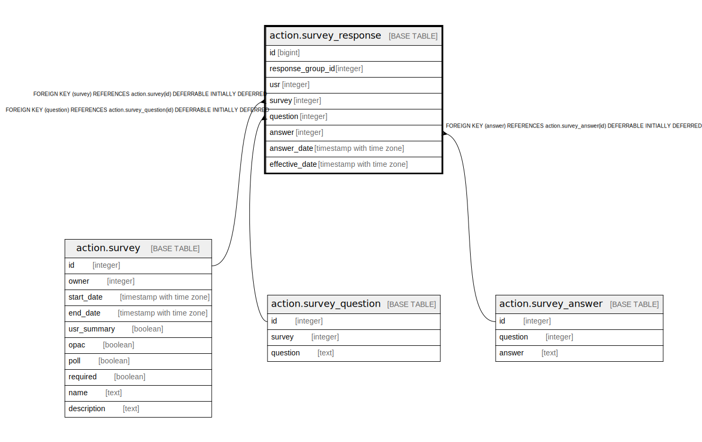

# action.survey_response

## Description

## Columns

| Name | Type | Default | Nullable | Children | Parents | Comment |
| ---- | ---- | ------- | -------- | -------- | ------- | ------- |
| id | bigint | nextval('action.survey_response_id_seq'::regclass) | false |  |  |  |
| response_group_id | integer |  | true |  |  |  |
| usr | integer |  | true |  |  |  |
| survey | integer |  | false |  | [action.survey](action.survey.md) |  |
| question | integer |  | false |  | [action.survey_question](action.survey_question.md) |  |
| answer | integer |  | false |  | [action.survey_answer](action.survey_answer.md) |  |
| answer_date | timestamp with time zone |  | true |  |  |  |
| effective_date | timestamp with time zone | now() | false |  |  |  |

## Constraints

| Name | Type | Definition |
| ---- | ---- | ---------- |
| survey_response_answer_fkey | FOREIGN KEY | FOREIGN KEY (answer) REFERENCES action.survey_answer(id) DEFERRABLE INITIALLY DEFERRED |
| survey_response_survey_fkey | FOREIGN KEY | FOREIGN KEY (survey) REFERENCES action.survey(id) DEFERRABLE INITIALLY DEFERRED |
| survey_response_question_fkey | FOREIGN KEY | FOREIGN KEY (question) REFERENCES action.survey_question(id) DEFERRABLE INITIALLY DEFERRED |
| survey_response_pkey | PRIMARY KEY | PRIMARY KEY (id) |

## Indexes

| Name | Definition |
| ---- | ---------- |
| survey_response_pkey | CREATE UNIQUE INDEX survey_response_pkey ON action.survey_response USING btree (id) |
| action_survey_response_usr_idx | CREATE INDEX action_survey_response_usr_idx ON action.survey_response USING btree (usr) |

## Triggers

| Name | Definition |
| ---- | ---------- |
| action_survey_response_answer_date_fixup_tgr | CREATE TRIGGER action_survey_response_answer_date_fixup_tgr BEFORE INSERT ON action.survey_response FOR EACH ROW EXECUTE PROCEDURE action.survey_response_answer_date_fixup() |

## Relations

---

> Generated by [tbls](https://github.com/k1LoW/tbls)
