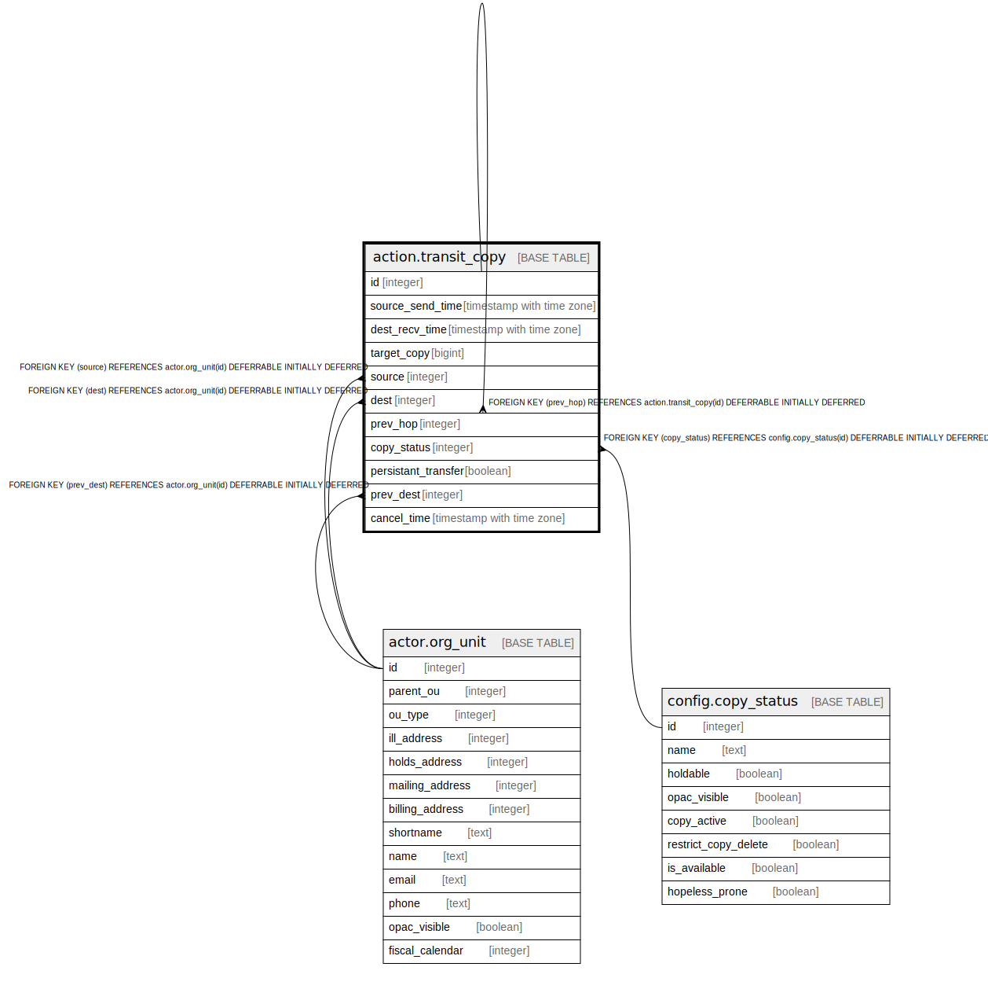

# action.transit_copy

## Description

## Columns

| Name | Type | Default | Nullable | Children | Parents | Comment |
| ---- | ---- | ------- | -------- | -------- | ------- | ------- |
| id | integer | nextval('action.transit_copy_id_seq'::regclass) | false | [action.transit_copy](action.transit_copy.md) |  |  |
| source_send_time | timestamp with time zone |  | true |  |  |  |
| dest_recv_time | timestamp with time zone |  | true |  |  |  |
| target_copy | bigint |  | false |  |  |  |
| source | integer |  | false |  | [actor.org_unit](actor.org_unit.md) |  |
| dest | integer |  | false |  | [actor.org_unit](actor.org_unit.md) |  |
| prev_hop | integer |  | true |  | [action.transit_copy](action.transit_copy.md) |  |
| copy_status | integer |  | false |  | [config.copy_status](config.copy_status.md) |  |
| persistant_transfer | boolean | false | false |  |  |  |
| prev_dest | integer |  | true |  | [actor.org_unit](actor.org_unit.md) |  |
| cancel_time | timestamp with time zone |  | true |  |  |  |

## Constraints

| Name | Type | Definition |
| ---- | ---- | ---------- |
| transit_copy_is_unique_check | TRIGGER | CREATE CONSTRAINT TRIGGER transit_copy_is_unique_check AFTER INSERT ON action.transit_copy NOT DEFERRABLE INITIALLY IMMEDIATE FOR EACH ROW EXECUTE PROCEDURE action.copy_transit_is_unique() |
| transit_copy_pkey | PRIMARY KEY | PRIMARY KEY (id) |
| transit_copy_prev_hop_fkey | FOREIGN KEY | FOREIGN KEY (prev_hop) REFERENCES action.transit_copy(id) DEFERRABLE INITIALLY DEFERRED |
| transit_copy_dest_fkey | FOREIGN KEY | FOREIGN KEY (dest) REFERENCES actor.org_unit(id) DEFERRABLE INITIALLY DEFERRED |
| transit_copy_prev_dest_fkey | FOREIGN KEY | FOREIGN KEY (prev_dest) REFERENCES actor.org_unit(id) DEFERRABLE INITIALLY DEFERRED |
| transit_copy_source_fkey | FOREIGN KEY | FOREIGN KEY (source) REFERENCES actor.org_unit(id) DEFERRABLE INITIALLY DEFERRED |
| transit_copy_copy_status_fkey | FOREIGN KEY | FOREIGN KEY (copy_status) REFERENCES config.copy_status(id) DEFERRABLE INITIALLY DEFERRED |

## Indexes

| Name | Definition |
| ---- | ---------- |
| transit_copy_pkey | CREATE UNIQUE INDEX transit_copy_pkey ON action.transit_copy USING btree (id) |
| active_transit_cp_idx | CREATE INDEX active_transit_cp_idx ON action.transit_copy USING btree (target_copy) |
| active_transit_dest_idx | CREATE INDEX active_transit_dest_idx ON action.transit_copy USING btree (dest) |
| active_transit_for_copy | CREATE INDEX active_transit_for_copy ON action.transit_copy USING btree (target_copy) WHERE ((dest_recv_time IS NULL) AND (cancel_time IS NULL)) |
| active_transit_source_idx | CREATE INDEX active_transit_source_idx ON action.transit_copy USING btree (source) |

## Triggers

| Name | Definition |
| ---- | ---------- |
| transit_copy_is_unique_check | CREATE CONSTRAINT TRIGGER transit_copy_is_unique_check AFTER INSERT ON action.transit_copy NOT DEFERRABLE INITIALLY IMMEDIATE FOR EACH ROW EXECUTE PROCEDURE action.copy_transit_is_unique() |

## Relations

---

> Generated by [tbls](https://github.com/k1LoW/tbls)
