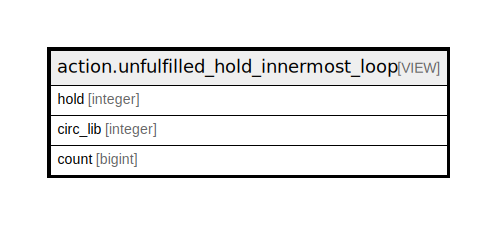

# action.unfulfilled_hold_innermost_loop

## Description

<details>
<summary><strong>Table Definition</strong></summary>

```sql
CREATE VIEW unfulfilled_hold_innermost_loop AS (
 SELECT DISTINCT l.hold,
    l.circ_lib,
    l.count
   FROM (action.unfulfilled_hold_loops l
     JOIN action.unfulfilled_hold_min_loop m USING (hold))
  WHERE (l.count = m.min)
)
```

</details>

## Columns

| Name | Type | Default | Nullable | Children | Parents | Comment |
| ---- | ---- | ------- | -------- | -------- | ------- | ------- |
| hold | integer |  | true |  |  |  |
| circ_lib | integer |  | true |  |  |  |
| count | bigint |  | true |  |  |  |

## Referenced Tables

| Name | Columns | Comment | Type |
| ---- | ------- | ------- | ---- |
| [action.unfulfilled_hold_loops](action.unfulfilled_hold_loops.md) | 3 |  | VIEW |
| [action.unfulfilled_hold_min_loop](action.unfulfilled_hold_min_loop.md) | 2 |  | VIEW |

## Relations



---

> Generated by [tbls](https://github.com/k1LoW/tbls)
