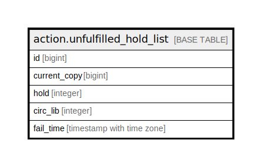

# action.unfulfilled_hold_list

## Description

## Columns

| Name | Type | Default | Nullable | Children | Parents | Comment |
| ---- | ---- | ------- | -------- | -------- | ------- | ------- |
| id | bigint | nextval('action.unfulfilled_hold_list_id_seq'::regclass) | false |  |  |  |
| current_copy | bigint |  | false |  |  |  |
| hold | integer |  | false |  |  |  |
| circ_lib | integer |  | false |  |  |  |
| fail_time | timestamp with time zone | now() | false |  |  |  |

## Constraints

| Name | Type | Definition |
| ---- | ---- | ---------- |
| unfulfilled_hold_list_pkey | PRIMARY KEY | PRIMARY KEY (id) |

## Indexes

| Name | Definition |
| ---- | ---------- |
| unfulfilled_hold_list_pkey | CREATE UNIQUE INDEX unfulfilled_hold_list_pkey ON action.unfulfilled_hold_list USING btree (id) |
| uhr_hold_idx | CREATE INDEX uhr_hold_idx ON action.unfulfilled_hold_list USING btree (hold) |

## Relations

---

> Generated by [tbls](https://github.com/k1LoW/tbls)
