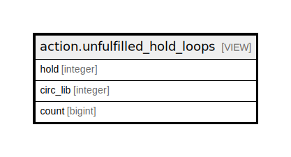

# action.unfulfilled_hold_loops

## Description

<details>
<summary><strong>Table Definition</strong></summary>

```sql
CREATE VIEW unfulfilled_hold_loops AS (
 SELECT u.hold,
    c.circ_lib,
    count(*) AS count
   FROM (action.unfulfilled_hold_list u
     JOIN asset.copy c ON ((c.id = u.current_copy)))
  GROUP BY u.hold, c.circ_lib
)
```

</details>

## Columns

| Name | Type | Default | Nullable | Children | Parents | Comment |
| ---- | ---- | ------- | -------- | -------- | ------- | ------- |
| hold | integer |  | true |  |  |  |
| circ_lib | integer |  | true |  |  |  |
| count | bigint |  | true |  |  |  |

## Referenced Tables

| Name | Columns | Comment | Type |
| ---- | ------- | ------- | ---- |
| [action.unfulfilled_hold_list](action.unfulfilled_hold_list.md) | 5 |  | BASE TABLE |
| [asset.copy](asset.copy.md) | 33 |  | BASE TABLE |

## Relations



---

> Generated by [tbls](https://github.com/k1LoW/tbls)
