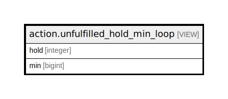

# action.unfulfilled_hold_min_loop

## Description

<details>
<summary><strong>Table Definition</strong></summary>

```sql
CREATE VIEW unfulfilled_hold_min_loop AS (
 SELECT unfulfilled_hold_loops.hold,
    min(unfulfilled_hold_loops.count) AS min
   FROM action.unfulfilled_hold_loops
  GROUP BY unfulfilled_hold_loops.hold
)
```

</details>

## Columns

| Name | Type | Default | Nullable | Children | Parents | Comment |
| ---- | ---- | ------- | -------- | -------- | ------- | ------- |
| hold | integer |  | true |  |  |  |
| min | bigint |  | true |  |  |  |

## Referenced Tables

| Name | Columns | Comment | Type |
| ---- | ------- | ------- | ---- |
| [action.unfulfilled_hold_loops](action.unfulfilled_hold_loops.md) | 3 |  | VIEW |

## Relations



---

> Generated by [tbls](https://github.com/k1LoW/tbls)
