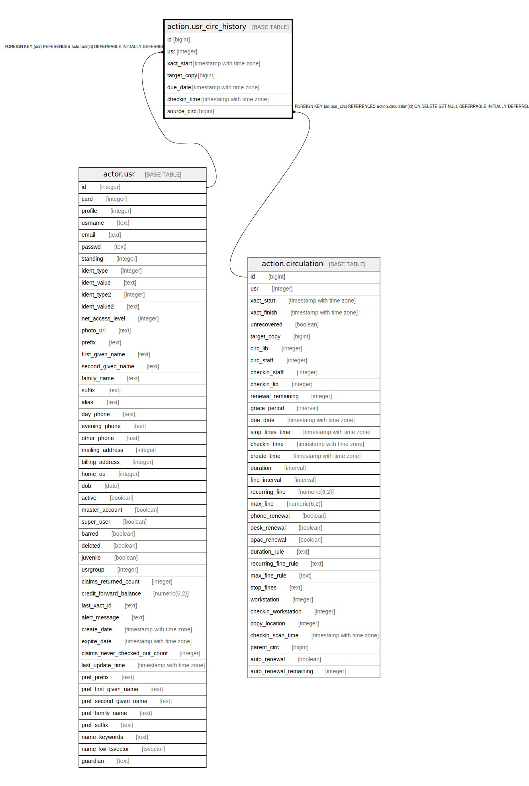

# action.usr_circ_history

## Description

## Columns

| Name | Type | Default | Nullable | Children | Parents | Comment |
| ---- | ---- | ------- | -------- | -------- | ------- | ------- |
| id | bigint | nextval('action.usr_circ_history_id_seq'::regclass) | false |  |  |  |
| usr | integer |  | false |  | [actor.usr](actor.usr.md) |  |
| xact_start | timestamp with time zone | now() | false |  |  |  |
| target_copy | bigint |  | false |  |  |  |
| due_date | timestamp with time zone |  | false |  |  |  |
| checkin_time | timestamp with time zone |  | true |  |  |  |
| source_circ | bigint |  | true |  | [action.circulation](action.circulation.md) |  |

## Constraints

| Name | Type | Definition |
| ---- | ---- | ---------- |
| usr_circ_history_source_circ_fkey | FOREIGN KEY | FOREIGN KEY (source_circ) REFERENCES action.circulation(id) ON DELETE SET NULL DEFERRABLE INITIALLY DEFERRED |
| usr_circ_history_pkey | PRIMARY KEY | PRIMARY KEY (id) |
| usr_circ_history_usr_fkey | FOREIGN KEY | FOREIGN KEY (usr) REFERENCES actor.usr(id) DEFERRABLE INITIALLY DEFERRED |

## Indexes

| Name | Definition |
| ---- | ---------- |
| usr_circ_history_pkey | CREATE UNIQUE INDEX usr_circ_history_pkey ON action.usr_circ_history USING btree (id) |
| action_usr_circ_history_source_circ_idx | CREATE INDEX action_usr_circ_history_source_circ_idx ON action.usr_circ_history USING btree (source_circ) |
| action_usr_circ_history_usr_idx | CREATE INDEX action_usr_circ_history_usr_idx ON action.usr_circ_history USING btree (usr) |

## Triggers

| Name | Definition |
| ---- | ---------- |
| action_usr_circ_history_target_copy_trig | CREATE TRIGGER action_usr_circ_history_target_copy_trig AFTER INSERT OR UPDATE ON action.usr_circ_history FOR EACH ROW EXECUTE PROCEDURE fake_fkey_tgr('target_copy') |

## Relations

---

> Generated by [tbls](https://github.com/k1LoW/tbls)
