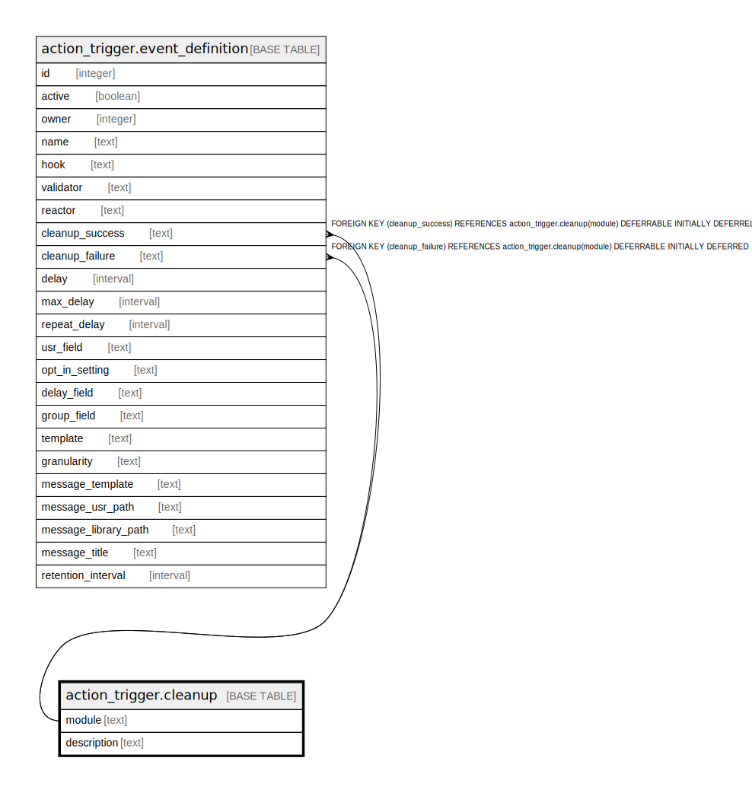

# action_trigger.cleanup

## Description

## Columns

| Name | Type | Default | Nullable | Children | Parents | Comment |
| ---- | ---- | ------- | -------- | -------- | ------- | ------- |
| module | text |  | false | [action_trigger.event_definition](action_trigger.event_definition.md) |  |  |
| description | text |  | true |  |  |  |

## Constraints

| Name | Type | Definition |
| ---- | ---- | ---------- |
| cleanup_pkey | PRIMARY KEY | PRIMARY KEY (module) |

## Indexes

| Name | Definition |
| ---- | ---------- |
| cleanup_pkey | CREATE UNIQUE INDEX cleanup_pkey ON action_trigger.cleanup USING btree (module) |

## Relations

---

> Generated by [tbls](https://github.com/k1LoW/tbls)
