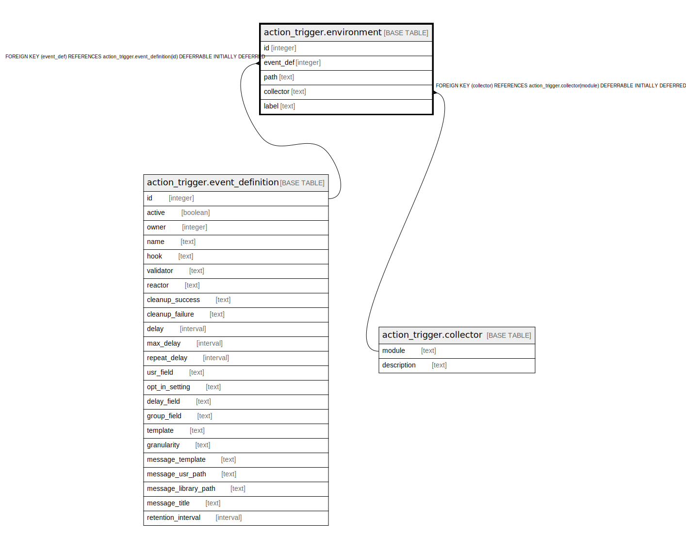

# action_trigger.environment

## Description

## Columns

| Name | Type | Default | Nullable | Children | Parents | Comment |
| ---- | ---- | ------- | -------- | -------- | ------- | ------- |
| id | integer | nextval('action_trigger.environment_id_seq'::regclass) | false |  |  |  |
| event_def | integer |  | false |  | [action_trigger.event_definition](action_trigger.event_definition.md) |  |
| path | text |  | true |  |  |  |
| collector | text |  | true |  | [action_trigger.collector](action_trigger.collector.md) |  |
| label | text |  | true |  |  |  |

## Constraints

| Name | Type | Definition |
| ---- | ---- | ---------- |
| environment_label_check | CHECK | CHECK ((label <> ALL (ARRAY['result'::text, 'target'::text, 'event'::text]))) |
| environment_collector_fkey | FOREIGN KEY | FOREIGN KEY (collector) REFERENCES action_trigger.collector(module) DEFERRABLE INITIALLY DEFERRED |
| env_event_label_once | UNIQUE | UNIQUE (event_def, label) |
| environment_pkey | PRIMARY KEY | PRIMARY KEY (id) |
| environment_event_def_fkey | FOREIGN KEY | FOREIGN KEY (event_def) REFERENCES action_trigger.event_definition(id) DEFERRABLE INITIALLY DEFERRED |

## Indexes

| Name | Definition |
| ---- | ---------- |
| env_event_label_once | CREATE UNIQUE INDEX env_event_label_once ON action_trigger.environment USING btree (event_def, label) |
| environment_pkey | CREATE UNIQUE INDEX environment_pkey ON action_trigger.environment USING btree (id) |

## Relations

---

> Generated by [tbls](https://github.com/k1LoW/tbls)
