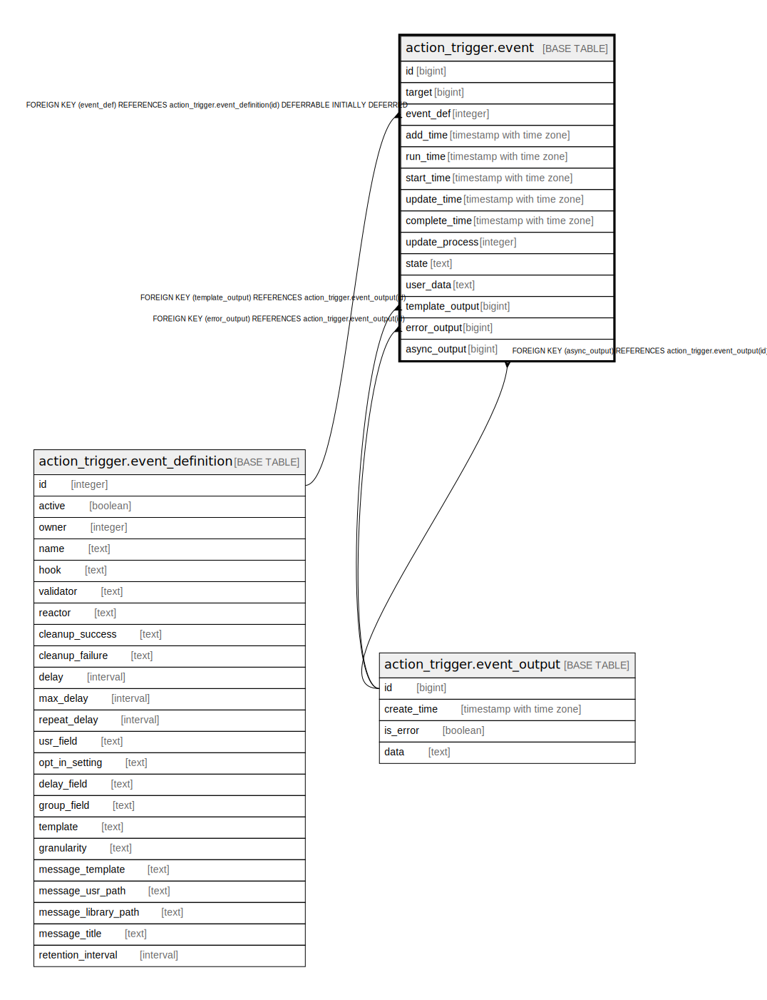

# action_trigger.event

## Description

## Columns

| Name | Type | Default | Nullable | Children | Parents | Comment |
| ---- | ---- | ------- | -------- | -------- | ------- | ------- |
| id | bigint | nextval('action_trigger.event_id_seq'::regclass) | false |  |  |  |
| target | bigint |  | false |  |  |  |
| event_def | integer |  | true |  | [action_trigger.event_definition](action_trigger.event_definition.md) |  |
| add_time | timestamp with time zone | now() | false |  |  |  |
| run_time | timestamp with time zone |  | false |  |  |  |
| start_time | timestamp with time zone |  | true |  |  |  |
| update_time | timestamp with time zone |  | true |  |  |  |
| complete_time | timestamp with time zone |  | true |  |  |  |
| update_process | integer |  | true |  |  |  |
| state | text | 'pending'::text | false |  |  |  |
| user_data | text |  | true |  |  |  |
| template_output | bigint |  | true |  | [action_trigger.event_output](action_trigger.event_output.md) |  |
| error_output | bigint |  | true |  | [action_trigger.event_output](action_trigger.event_output.md) |  |
| async_output | bigint |  | true |  | [action_trigger.event_output](action_trigger.event_output.md) |  |

## Constraints

| Name | Type | Definition |
| ---- | ---- | ---------- |
| event_state_check | CHECK | CHECK ((state = ANY (ARRAY['pending'::text, 'invalid'::text, 'found'::text, 'collecting'::text, 'collected'::text, 'validating'::text, 'valid'::text, 'reacting'::text, 'reacted'::text, 'cleaning'::text, 'complete'::text, 'error'::text]))) |
| event_user_data_check | CHECK | CHECK (((user_data IS NULL) OR is_json(user_data))) |
| event_event_def_fkey | FOREIGN KEY | FOREIGN KEY (event_def) REFERENCES action_trigger.event_definition(id) DEFERRABLE INITIALLY DEFERRED |
| event_async_output_fkey | FOREIGN KEY | FOREIGN KEY (async_output) REFERENCES action_trigger.event_output(id) |
| event_error_output_fkey | FOREIGN KEY | FOREIGN KEY (error_output) REFERENCES action_trigger.event_output(id) |
| event_template_output_fkey | FOREIGN KEY | FOREIGN KEY (template_output) REFERENCES action_trigger.event_output(id) |
| event_pkey | PRIMARY KEY | PRIMARY KEY (id) |

## Indexes

| Name | Definition |
| ---- | ---------- |
| event_pkey | CREATE UNIQUE INDEX event_pkey ON action_trigger.event USING btree (id) |
| atev_async_output | CREATE INDEX atev_async_output ON action_trigger.event USING btree (async_output) |
| atev_def_state | CREATE INDEX atev_def_state ON action_trigger.event USING btree (event_def, state) |
| atev_error_output | CREATE INDEX atev_error_output ON action_trigger.event USING btree (error_output) |
| atev_target_def_idx | CREATE INDEX atev_target_def_idx ON action_trigger.event USING btree (target, event_def) |
| atev_template_output | CREATE INDEX atev_template_output ON action_trigger.event USING btree (template_output) |

## Relations

---

> Generated by [tbls](https://github.com/k1LoW/tbls)
