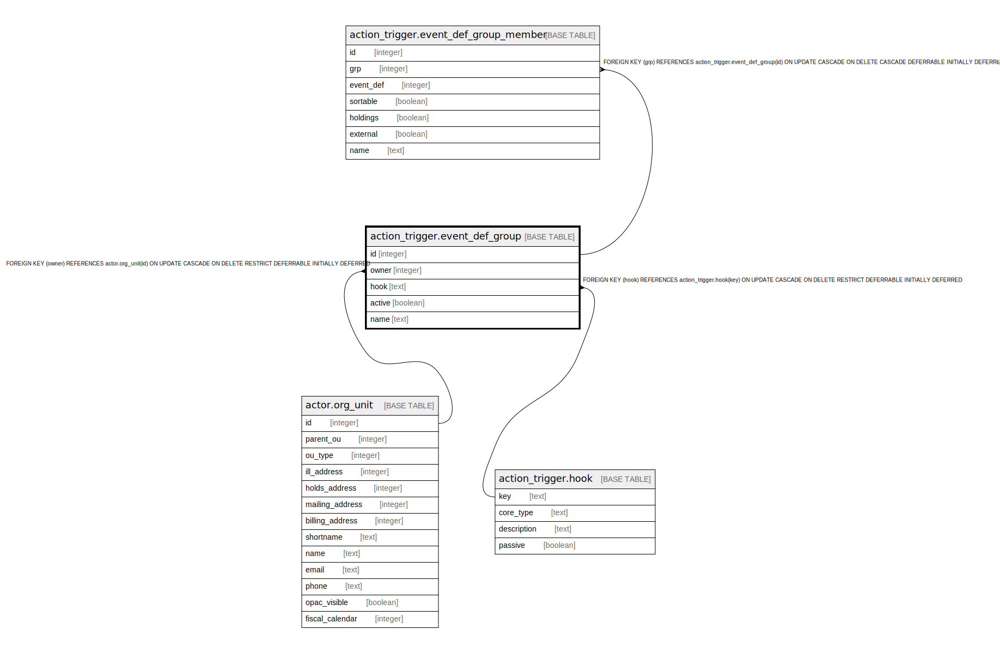

# action_trigger.event_def_group

## Description

## Columns

| Name | Type | Default | Nullable | Children | Parents | Comment |
| ---- | ---- | ------- | -------- | -------- | ------- | ------- |
| id | integer | nextval('action_trigger.event_def_group_id_seq'::regclass) | false | [action_trigger.event_def_group_member](action_trigger.event_def_group_member.md) |  |  |
| owner | integer |  | false |  | [actor.org_unit](actor.org_unit.md) |  |
| hook | text |  | false |  | [action_trigger.hook](action_trigger.hook.md) |  |
| active | boolean | true | false |  |  |  |
| name | text |  | false |  |  |  |

## Constraints

| Name | Type | Definition |
| ---- | ---- | ---------- |
| event_def_group_pkey | PRIMARY KEY | PRIMARY KEY (id) |
| event_def_group_hook_fkey | FOREIGN KEY | FOREIGN KEY (hook) REFERENCES action_trigger.hook(key) ON UPDATE CASCADE ON DELETE RESTRICT DEFERRABLE INITIALLY DEFERRED |
| event_def_group_owner_fkey | FOREIGN KEY | FOREIGN KEY (owner) REFERENCES actor.org_unit(id) ON UPDATE CASCADE ON DELETE RESTRICT DEFERRABLE INITIALLY DEFERRED |

## Indexes

| Name | Definition |
| ---- | ---------- |
| event_def_group_pkey | CREATE UNIQUE INDEX event_def_group_pkey ON action_trigger.event_def_group USING btree (id) |

## Relations

---

> Generated by [tbls](https://github.com/k1LoW/tbls)
