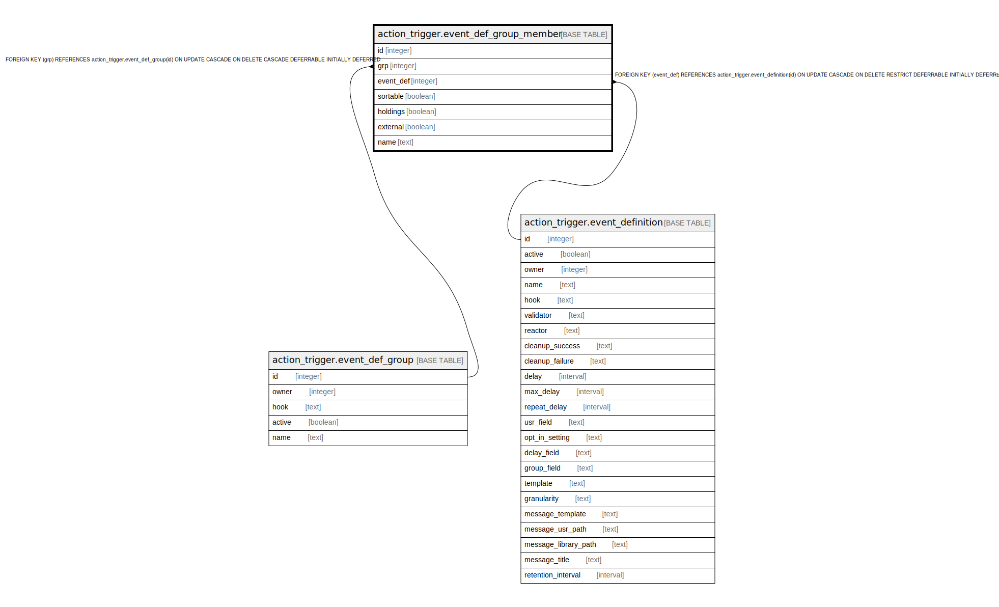

# action_trigger.event_def_group_member

## Description

## Columns

| Name | Type | Default | Nullable | Children | Parents | Comment |
| ---- | ---- | ------- | -------- | -------- | ------- | ------- |
| id | integer | nextval('action_trigger.event_def_group_member_id_seq'::regclass) | false |  |  |  |
| grp | integer |  | false |  | [action_trigger.event_def_group](action_trigger.event_def_group.md) |  |
| event_def | integer |  | false |  | [action_trigger.event_definition](action_trigger.event_definition.md) |  |
| sortable | boolean | true | false |  |  |  |
| holdings | boolean | false | false |  |  |  |
| external | boolean | false | false |  |  |  |
| name | text |  | false |  |  |  |

## Constraints

| Name | Type | Definition |
| ---- | ---- | ---------- |
| event_def_group_member_pkey | PRIMARY KEY | PRIMARY KEY (id) |
| event_def_group_member_grp_fkey | FOREIGN KEY | FOREIGN KEY (grp) REFERENCES action_trigger.event_def_group(id) ON UPDATE CASCADE ON DELETE CASCADE DEFERRABLE INITIALLY DEFERRED |
| event_def_group_member_event_def_fkey | FOREIGN KEY | FOREIGN KEY (event_def) REFERENCES action_trigger.event_definition(id) ON UPDATE CASCADE ON DELETE RESTRICT DEFERRABLE INITIALLY DEFERRED |

## Indexes

| Name | Definition |
| ---- | ---------- |
| event_def_group_member_pkey | CREATE UNIQUE INDEX event_def_group_member_pkey ON action_trigger.event_def_group_member USING btree (id) |

## Relations

---

> Generated by [tbls](https://github.com/k1LoW/tbls)
