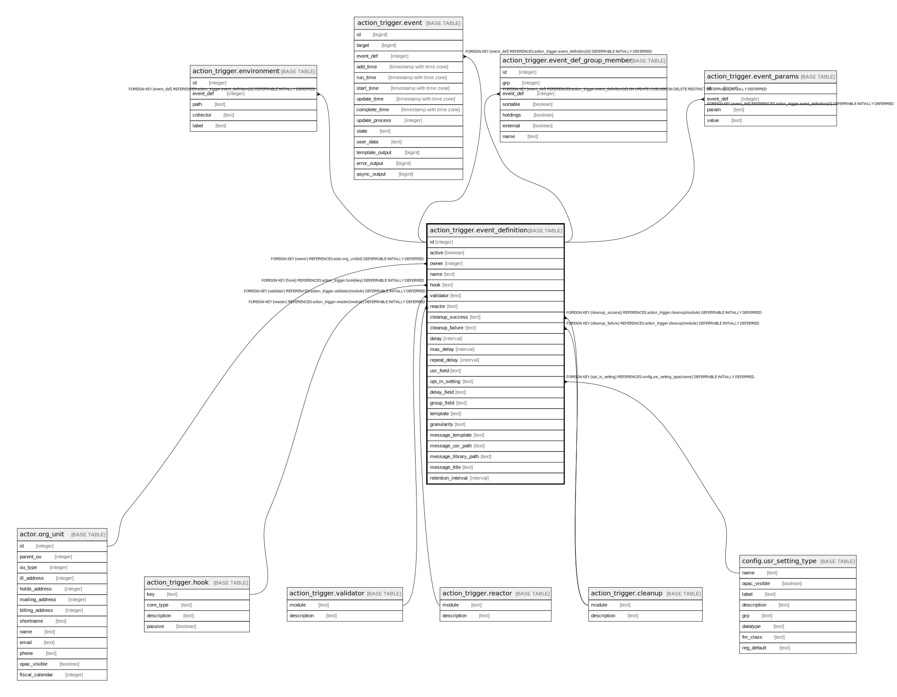

# action_trigger.event_definition

## Description

## Columns

| Name | Type | Default | Nullable | Children | Parents | Comment |
| ---- | ---- | ------- | -------- | -------- | ------- | ------- |
| id | integer | nextval('action_trigger.event_definition_id_seq'::regclass) | false | [action_trigger.environment](action_trigger.environment.md) [action_trigger.event](action_trigger.event.md) [action_trigger.event_def_group_member](action_trigger.event_def_group_member.md) [action_trigger.event_params](action_trigger.event_params.md) |  |  |
| active | boolean | true | false |  |  |  |
| owner | integer |  | false |  | [actor.org_unit](actor.org_unit.md) |  |
| name | text |  | false |  |  |  |
| hook | text |  | false |  | [action_trigger.hook](action_trigger.hook.md) |  |
| validator | text |  | false |  | [action_trigger.validator](action_trigger.validator.md) |  |
| reactor | text |  | false |  | [action_trigger.reactor](action_trigger.reactor.md) |  |
| cleanup_success | text |  | true |  | [action_trigger.cleanup](action_trigger.cleanup.md) |  |
| cleanup_failure | text |  | true |  | [action_trigger.cleanup](action_trigger.cleanup.md) |  |
| delay | interval | '00:05:00'::interval | false |  |  |  |
| max_delay | interval |  | true |  |  |  |
| repeat_delay | interval |  | true |  |  |  |
| usr_field | text |  | true |  |  |  |
| opt_in_setting | text |  | true |  | [config.usr_setting_type](config.usr_setting_type.md) |  |
| delay_field | text |  | true |  |  |  |
| group_field | text |  | true |  |  |  |
| template | text |  | true |  |  |  |
| granularity | text |  | true |  |  |  |
| message_template | text |  | true |  |  |  |
| message_usr_path | text |  | true |  |  |  |
| message_library_path | text |  | true |  |  |  |
| message_title | text |  | true |  |  |  |
| retention_interval | interval |  | true |  |  |  |

## Constraints

| Name | Type | Definition |
| ---- | ---- | ---------- |
| event_definition_cleanup_failure_fkey | FOREIGN KEY | FOREIGN KEY (cleanup_failure) REFERENCES action_trigger.cleanup(module) DEFERRABLE INITIALLY DEFERRED |
| event_definition_cleanup_success_fkey | FOREIGN KEY | FOREIGN KEY (cleanup_success) REFERENCES action_trigger.cleanup(module) DEFERRABLE INITIALLY DEFERRED |
| ev_def_name_owner_once | UNIQUE | UNIQUE (owner, name) |
| ev_def_owner_hook_val_react_clean_delay_once | UNIQUE | UNIQUE (owner, hook, validator, reactor, delay, delay_field) |
| event_definition_pkey | PRIMARY KEY | PRIMARY KEY (id) |
| event_definition_hook_fkey | FOREIGN KEY | FOREIGN KEY (hook) REFERENCES action_trigger.hook(key) DEFERRABLE INITIALLY DEFERRED |
| event_definition_reactor_fkey | FOREIGN KEY | FOREIGN KEY (reactor) REFERENCES action_trigger.reactor(module) DEFERRABLE INITIALLY DEFERRED |
| event_definition_validator_fkey | FOREIGN KEY | FOREIGN KEY (validator) REFERENCES action_trigger.validator(module) DEFERRABLE INITIALLY DEFERRED |
| event_definition_owner_fkey | FOREIGN KEY | FOREIGN KEY (owner) REFERENCES actor.org_unit(id) DEFERRABLE INITIALLY DEFERRED |
| event_definition_opt_in_setting_fkey | FOREIGN KEY | FOREIGN KEY (opt_in_setting) REFERENCES config.usr_setting_type(name) DEFERRABLE INITIALLY DEFERRED |

## Indexes

| Name | Definition |
| ---- | ---------- |
| ev_def_name_owner_once | CREATE UNIQUE INDEX ev_def_name_owner_once ON action_trigger.event_definition USING btree (owner, name) |
| ev_def_owner_hook_val_react_clean_delay_once | CREATE UNIQUE INDEX ev_def_owner_hook_val_react_clean_delay_once ON action_trigger.event_definition USING btree (owner, hook, validator, reactor, delay, delay_field) |
| event_definition_pkey | CREATE UNIQUE INDEX event_definition_pkey ON action_trigger.event_definition USING btree (id) |

## Triggers

| Name | Definition |
| ---- | ---------- |
| is_valid_retention_interval | CREATE TRIGGER is_valid_retention_interval BEFORE INSERT OR UPDATE ON action_trigger.event_definition FOR EACH ROW WHEN ((new.retention_interval IS NOT NULL)) EXECUTE PROCEDURE action_trigger.check_valid_retention_interval() |

## Relations

---

> Generated by [tbls](https://github.com/k1LoW/tbls)
