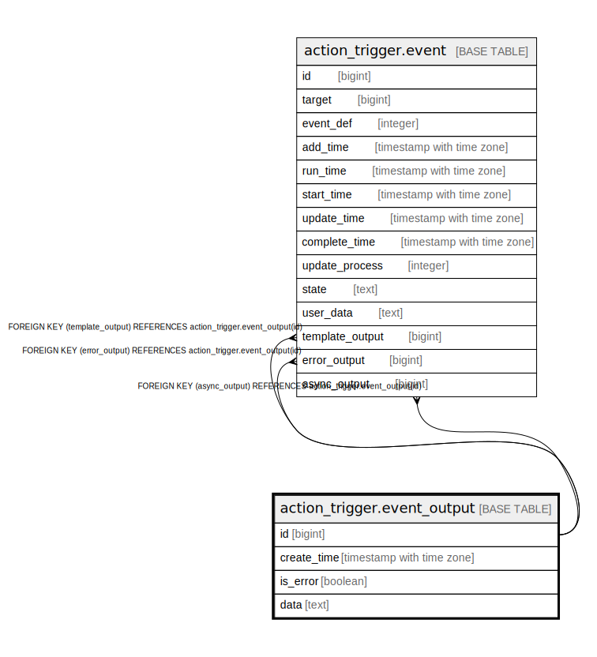

# action_trigger.event_output

## Description

## Columns

| Name | Type | Default | Nullable | Children | Parents | Comment |
| ---- | ---- | ------- | -------- | -------- | ------- | ------- |
| id | bigint | nextval('action_trigger.event_output_id_seq'::regclass) | false | [action_trigger.event](action_trigger.event.md) |  |  |
| create_time | timestamp with time zone | now() | false |  |  |  |
| is_error | boolean | false | false |  |  |  |
| data | text |  | false |  |  |  |

## Constraints

| Name | Type | Definition |
| ---- | ---- | ---------- |
| event_output_pkey | PRIMARY KEY | PRIMARY KEY (id) |

## Indexes

| Name | Definition |
| ---- | ---------- |
| event_output_pkey | CREATE UNIQUE INDEX event_output_pkey ON action_trigger.event_output USING btree (id) |

## Relations

---

> Generated by [tbls](https://github.com/k1LoW/tbls)
