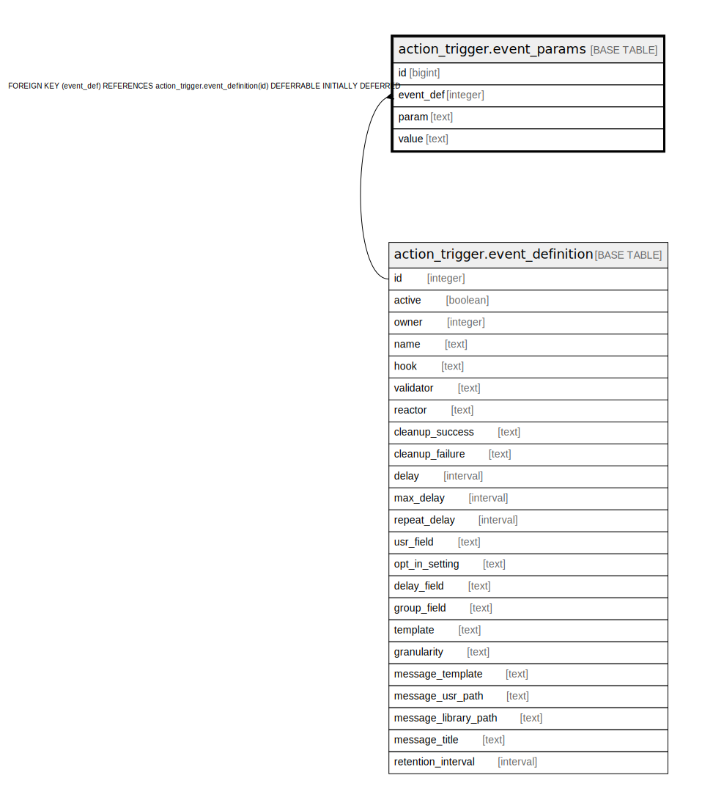

# action_trigger.event_params

## Description

## Columns

| Name | Type | Default | Nullable | Children | Parents | Comment |
| ---- | ---- | ------- | -------- | -------- | ------- | ------- |
| id | bigint | nextval('action_trigger.event_params_id_seq'::regclass) | false |  |  |  |
| event_def | integer |  | false |  | [action_trigger.event_definition](action_trigger.event_definition.md) |  |
| param | text |  | false |  |  |  |
| value | text |  | false |  |  |  |

## Constraints

| Name | Type | Definition |
| ---- | ---- | ---------- |
| event_params_event_def_fkey | FOREIGN KEY | FOREIGN KEY (event_def) REFERENCES action_trigger.event_definition(id) DEFERRABLE INITIALLY DEFERRED |
| event_params_event_def_param_once | UNIQUE | UNIQUE (event_def, param) |
| event_params_pkey | PRIMARY KEY | PRIMARY KEY (id) |

## Indexes

| Name | Definition |
| ---- | ---------- |
| event_params_event_def_param_once | CREATE UNIQUE INDEX event_params_event_def_param_once ON action_trigger.event_params USING btree (event_def, param) |
| event_params_pkey | CREATE UNIQUE INDEX event_params_pkey ON action_trigger.event_params USING btree (id) |

## Relations

---

> Generated by [tbls](https://github.com/k1LoW/tbls)
