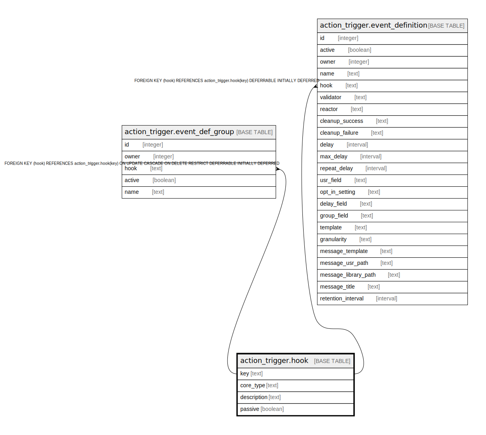

# action_trigger.hook

## Description

## Columns

| Name | Type | Default | Nullable | Children | Parents | Comment |
| ---- | ---- | ------- | -------- | -------- | ------- | ------- |
| key | text |  | false | [action_trigger.event_def_group](action_trigger.event_def_group.md) [action_trigger.event_definition](action_trigger.event_definition.md) |  |  |
| core_type | text |  | false |  |  |  |
| description | text |  | true |  |  |  |
| passive | boolean | false | false |  |  |  |

## Constraints

| Name | Type | Definition |
| ---- | ---- | ---------- |
| hook_pkey | PRIMARY KEY | PRIMARY KEY (key) |

## Indexes

| Name | Definition |
| ---- | ---------- |
| hook_pkey | CREATE UNIQUE INDEX hook_pkey ON action_trigger.hook USING btree (key) |

## Relations

---

> Generated by [tbls](https://github.com/k1LoW/tbls)
