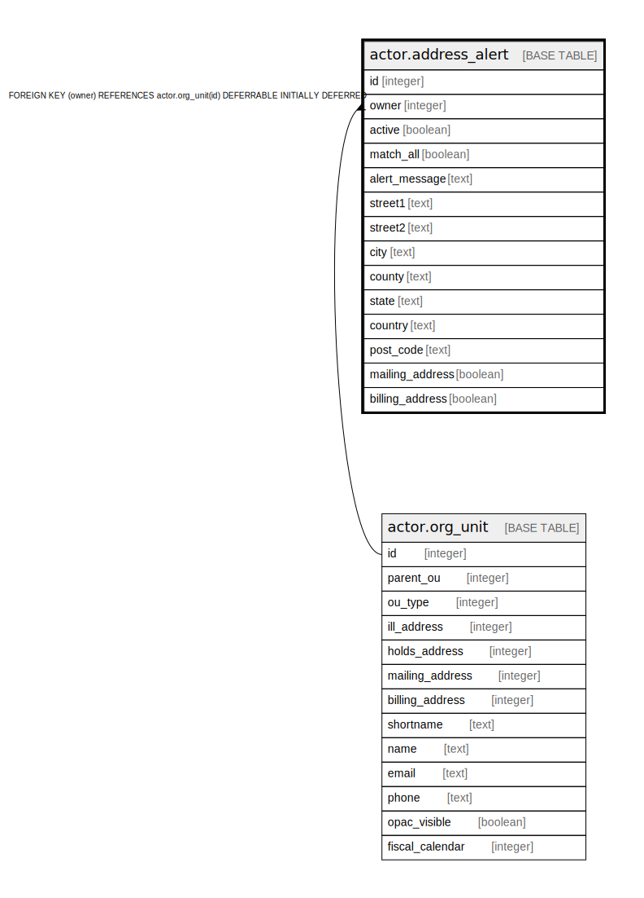

# actor.address_alert

## Description

## Columns

| Name | Type | Default | Nullable | Children | Parents | Comment |
| ---- | ---- | ------- | -------- | -------- | ------- | ------- |
| id | integer | nextval('actor.address_alert_id_seq'::regclass) | false |  |  |  |
| owner | integer |  | false |  | [actor.org_unit](actor.org_unit.md) |  |
| active | boolean | true | false |  |  |  |
| match_all | boolean | true | false |  |  |  |
| alert_message | text |  | false |  |  |  |
| street1 | text |  | true |  |  |  |
| street2 | text |  | true |  |  |  |
| city | text |  | true |  |  |  |
| county | text |  | true |  |  |  |
| state | text |  | true |  |  |  |
| country | text |  | true |  |  |  |
| post_code | text |  | true |  |  |  |
| mailing_address | boolean | false | false |  |  |  |
| billing_address | boolean | false | false |  |  |  |

## Constraints

| Name | Type | Definition |
| ---- | ---- | ---------- |
| address_alert_pkey | PRIMARY KEY | PRIMARY KEY (id) |
| address_alert_owner_fkey | FOREIGN KEY | FOREIGN KEY (owner) REFERENCES actor.org_unit(id) DEFERRABLE INITIALLY DEFERRED |

## Indexes

| Name | Definition |
| ---- | ---------- |
| address_alert_pkey | CREATE UNIQUE INDEX address_alert_pkey ON actor.address_alert USING btree (id) |

## Relations

---

> Generated by [tbls](https://github.com/k1LoW/tbls)
