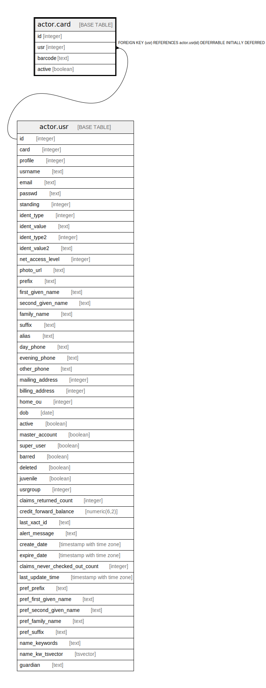

# actor.card

## Description

  
Library Cards  
  
Each User has one or more library cards.  The current "main"  
card is linked to here from the actor.usr table, and it is up  
to the consortium policy whether more than one card can be  
active for any one user at a given time.  

## Columns

| Name | Type | Default | Nullable | Children | Parents | Comment |
| ---- | ---- | ------- | -------- | -------- | ------- | ------- |
| id | integer | nextval('actor.card_id_seq'::regclass) | false |  |  |  |
| usr | integer |  | false |  | [actor.usr](actor.usr.md) |  |
| barcode | text |  | false |  |  |  |
| active | boolean | true | false |  |  |  |

## Constraints

| Name | Type | Definition |
| ---- | ---- | ---------- |
| card_barcode_key | UNIQUE | UNIQUE (barcode) |
| card_pkey | PRIMARY KEY | PRIMARY KEY (id) |
| card_usr_fkey | FOREIGN KEY | FOREIGN KEY (usr) REFERENCES actor.usr(id) DEFERRABLE INITIALLY DEFERRED |

## Indexes

| Name | Definition |
| ---- | ---------- |
| card_barcode_key | CREATE UNIQUE INDEX card_barcode_key ON actor.card USING btree (barcode) |
| card_pkey | CREATE UNIQUE INDEX card_pkey ON actor.card USING btree (id) |
| actor_card_barcode_evergreen_lowercase_idx | CREATE INDEX actor_card_barcode_evergreen_lowercase_idx ON actor.card USING btree (lowercase(barcode)) |
| actor_card_usr_idx | CREATE INDEX actor_card_usr_idx ON actor.card USING btree (usr) |

## Relations

---

> Generated by [tbls](https://github.com/k1LoW/tbls)
