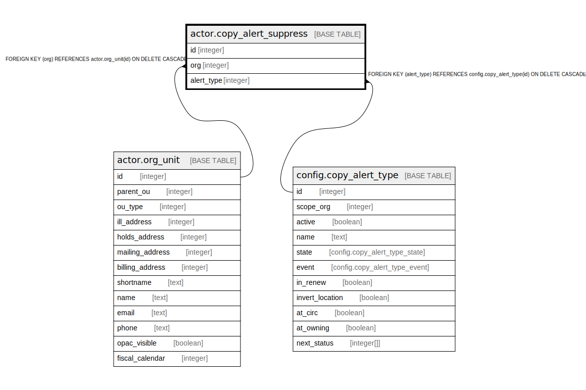

# actor.copy_alert_suppress

## Description

## Columns

| Name | Type | Default | Nullable | Children | Parents | Comment |
| ---- | ---- | ------- | -------- | -------- | ------- | ------- |
| id | integer | nextval('actor.copy_alert_suppress_id_seq'::regclass) | false |  |  |  |
| org | integer |  | false |  | [actor.org_unit](actor.org_unit.md) |  |
| alert_type | integer |  | false |  | [config.copy_alert_type](config.copy_alert_type.md) |  |

## Constraints

| Name | Type | Definition |
| ---- | ---- | ---------- |
| copy_alert_suppress_pkey | PRIMARY KEY | PRIMARY KEY (id) |
| copy_alert_suppress_org_fkey | FOREIGN KEY | FOREIGN KEY (org) REFERENCES actor.org_unit(id) ON DELETE CASCADE |
| copy_alert_suppress_alert_type_fkey | FOREIGN KEY | FOREIGN KEY (alert_type) REFERENCES config.copy_alert_type(id) ON DELETE CASCADE |

## Indexes

| Name | Definition |
| ---- | ---------- |
| copy_alert_suppress_pkey | CREATE UNIQUE INDEX copy_alert_suppress_pkey ON actor.copy_alert_suppress USING btree (id) |

## Relations

---

> Generated by [tbls](https://github.com/k1LoW/tbls)
