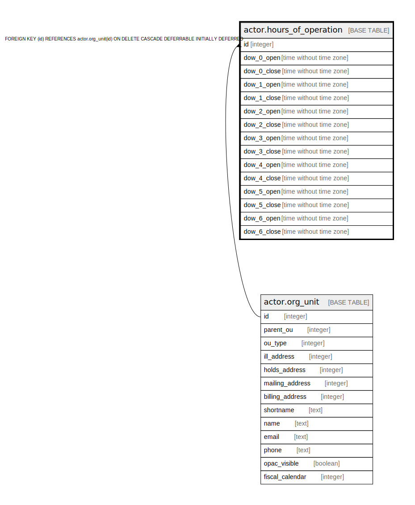

# actor.hours_of_operation

## Description

  
When does this org_unit usually open and close?  (Variations  
are expressed in the actor.org_unit_closed table.)  

## Columns

| Name | Type | Default | Nullable | Children | Parents | Comment |
| ---- | ---- | ------- | -------- | -------- | ------- | ------- |
| id | integer |  | false |  | [actor.org_unit](actor.org_unit.md) |  |
| dow_0_open | time without time zone | '09:00:00'::time without time zone | false |  |  |  When does this org_unit open on Monday?  |
| dow_0_close | time without time zone | '17:00:00'::time without time zone | false |  |  |  When does this org_unit close on Monday?  |
| dow_1_open | time without time zone | '09:00:00'::time without time zone | false |  |  |  When does this org_unit open on Tuesday?  |
| dow_1_close | time without time zone | '17:00:00'::time without time zone | false |  |  |  When does this org_unit close on Tuesday?  |
| dow_2_open | time without time zone | '09:00:00'::time without time zone | false |  |  |  When does this org_unit open on Wednesday?  |
| dow_2_close | time without time zone | '17:00:00'::time without time zone | false |  |  |  When does this org_unit close on Wednesday?  |
| dow_3_open | time without time zone | '09:00:00'::time without time zone | false |  |  |  When does this org_unit open on Thursday?  |
| dow_3_close | time without time zone | '17:00:00'::time without time zone | false |  |  |  When does this org_unit close on Thursday?  |
| dow_4_open | time without time zone | '09:00:00'::time without time zone | false |  |  |  When does this org_unit open on Friday?  |
| dow_4_close | time without time zone | '17:00:00'::time without time zone | false |  |  |  When does this org_unit close on Friday?  |
| dow_5_open | time without time zone | '09:00:00'::time without time zone | false |  |  |  When does this org_unit open on Saturday?  |
| dow_5_close | time without time zone | '17:00:00'::time without time zone | false |  |  |  When does this org_unit close on Saturday?  |
| dow_6_open | time without time zone | '09:00:00'::time without time zone | false |  |  |  When does this org_unit open on Sunday?  |
| dow_6_close | time without time zone | '17:00:00'::time without time zone | false |  |  |  When does this org_unit close on Sunday?  |

## Constraints

| Name | Type | Definition |
| ---- | ---- | ---------- |
| hours_of_operation_pkey | PRIMARY KEY | PRIMARY KEY (id) |
| hours_of_operation_id_fkey | FOREIGN KEY | FOREIGN KEY (id) REFERENCES actor.org_unit(id) ON DELETE CASCADE DEFERRABLE INITIALLY DEFERRED |

## Indexes

| Name | Definition |
| ---- | ---------- |
| hours_of_operation_pkey | CREATE UNIQUE INDEX hours_of_operation_pkey ON actor.hours_of_operation USING btree (id) |

## Relations

---

> Generated by [tbls](https://github.com/k1LoW/tbls)
